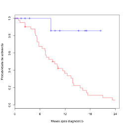
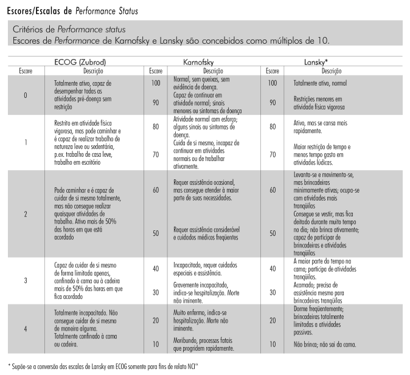
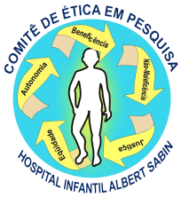
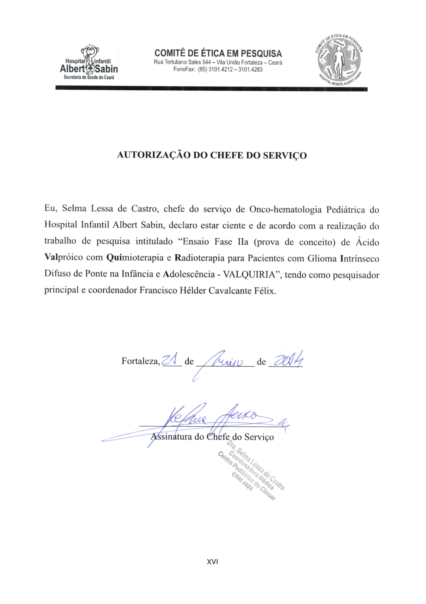

# PROJETO DE PESQUISA

## TÍTULO:

## Ensaio Fase IIa (prova de conceito) de Ácido **Val**próico com **Qui**mioterapia e **R**adioterapia para Pacientes com Glioma **I**ntrínseco Difuso de Ponte na Infância e **A**dolescência - VALQUIRIA

### SECRETARIA DE SAÚDE DO ESTADO DO CEARÁ

### HOSPITAL INFANTIL ALBERT SABIN

### CENTRO PEDIÁTRICO DO CÂNCER

----

# ÍNDICE

- [Apresentação](#apresentaÇÃo)                                            
- [Abreviações](#abreviaÇÕes)                                              
- [Resumo](#resumo)                                                         
- [Summary](#summary)                                                      
- Anteprojeto                                                              

1. [Introdução](#1introdução)                                               
2. [Apresentação do problema e fundamentação teórica](#2apresentação-do-problema-e-fundamentação-teórica)                         
3. [Justificativa](#3justificativa)                                         
4. [Objetivos](#4objetivos)                                                 
  1. Objetivo principal                                                     
  2. Objetivos secundários                                                  
5. [Metodologia](#5metodologia)                                            
  1. [Caracterização da pesquisa](#51caracterização-da-pesquisa)                                            
  2. [Local e participantes](#52local-e-participantes)                                                 
  3. [Critérios de inclusão e exclusão](#53critérios-de-inclusão-e-exclusão)
  4. [Procedimentos](#54procedimentos)                                      
  5. [Intervenção](#55intervenção)                                          
  6. [Análise estatística dos resultados](#56análise-estatística-dos-resultados)    
  7. [Tamanho da amostra](#57tamanho-da-amostra)                            
  8. [Coleta retrospectiva de dados para compor o grupo controle histórico](#58coleta-retrospectiva-de-dados-para-compor-o-grupo-controle-histórico)   
6. [Cronograma de execução do projeto](#6cronograma-de-execução-do-projeto)
7. [Recursos disponíveis](#7recursos-disponíveis)                                                    
8. [Orçamento](#8orçamento)                                                               
9. [Ressarcimento e desistência](#9ressarcimento-e-desistência)           
10. [Referências bibliográficas](#10referências-bibliográficas)           

- Anexos                                                                 
    - [Termo de consentimento livre e esclarecido](#termo-de-consentimento-livre-e-esclarecido)  
    - [Termo de Consentimento – Publicação em periódico científico de circulação nacional/internacional](#termo-de-consentimento--publicação-em-periódico-científico-de-circulação-nacionalinternacional)  
    - [Avaliação sócio-demográfica - Protocolo da OMS](#avaliaÇÃo-sÓcio-demogrÁfica--protocolo-da-oms)             
    - [Questionário para coleta de dados específicos sobre a doença oncológica](#questionário-para-coleta-de-dados-específicos-sobre-a-doença-oncológica)                                    
    - [Questionário para coleta de dados sequenciais](#questionário-para-coleta-de-dados-sequenciais)                  
    - [Escores/escalas de performance status](#escoresescalas-de-performance-status)                           
    - [Fichas de quimioterapia](#fichas-de-quimioterapia)                                                    
    - [Declaração de riscos e benefícios envolvidos](#declaraÇÃo-de-riscos-e-benefÍcios-envolvidos)              
    - [Autorização do Chefe de Serviço](#autorização-do-chefe-de-serviço)                                            
    - [Termo de compromisso do pesquisador](#termo-de-compromisso-do-pesquisador)                      
    - [Currículos dos Pesquisadores](#currÍculos-dos-pesquisadores)                                               

----

# APRESENTAÇÃO

## GRANDE ÁREA DO CONHECIMENTO: Ciências da Saúde

## ÁREA DO CONHECIMENTO: Medicina

## SUB-ÁREA DO CONHECIMENTO: Pediatria

## ESPECIALIDADE DO CONHECIMENTO: Cancerologia pediátrica

## EQUIPE EXECUTORA E ATRIBUIÇÕES:

### Francisco Hélder Cavalcante Félix

Médico Cancerologista Pediátrico do CPC-HIAS – Centro pediátrico do
Câncer do Hospital Infantil Albert Sabin, Mestre em Farmacologia pela
Universidade Federal do Ceará

Coordenador do estudo, desenho do estudo, médico assistente dos
pacientes, análise estatística

### Juvenia Bezerra Fontenele

Professora da Faculdade de Farmácia, Odontologia e Enfermagem da
Universidade Federal do Ceará, Doutora em Farmacologia pela Universidade
Federal do Ceará

Desenho do estudo, revisão bibliográfica, farmacologia do tratamento

----

# ABREVIAÇÕES

AFT - modelo de tempo de falha acelerado

CCNU - *N*-(2-cloroetil)-*N’*-ciclohexil-*N*-nitrosourea (lomustina)

CDDP - cis-diaminodicloroplatina(II) (cisplatina)

CEP - Comitê de Ética em Pesquisa

CLIA - *chemiluminescence immuno assay* (ensaio de quimioluminescência)

CNES - Cadastro Nacional de Estabelecimentos de Saúde

CNS - Conselho Nacional de Saúde

COG - Children's Oncology Group

CPC - Centro Pediátrico do Câncer

DAE - drogas antiepilépticas

DAENI - drogas antiepilépticas não indutoras de enzimas hepáticas

DE - doença estável

DICOM - *Digital Imaging and Communications in Medicine* (comunicação de
imagens digitais em medicina)

DIPG - gliomas intrínsecos difusos da ponte

DP - doença progressiva

EEG - eletroencefalograma

EORTC- European Organisation for Research and Treatment of Cancer

FLAIR - Fluid Attenuation Inversion Recovery

FMH - *Fertigkeitenskala Münster-Heidelberg* (Escala de habilidades de
Münster-Heidelberg)

G-CSF - *granulocyte colony-stimulating factor* (fator estimulador de
colônias de granulócitos)

GABA - ácido gama-amino-butírico

GCS - *Glasgow Coma Scale* (Escala de coma de Glasgow)

GPOH - *Gesellschaft für Pädiatrische Onkologie und Hämatologie*
(Sociedade de Oncologia e Hematologia Pediátrica)

HDAC - histona deacetilase

HIAS - Hospital Infantil Albert Sabin

HIT-GBM-C/D - *Hirn­tu­mo­ren-hoch­ma­lig­ne Glio­me*, terceiro e quarto
(C e D) protocolos de tratamento de gliomas malignos do GPOH.

IC95% - intervalo de confiança 95%

ICRU - International Comission on Radiation Units and Measurements

IFO - ifosfamida

INR - *international normalized ratio* (índice internacional
normalizado)

IV - intra-venoso

LPPS - *Lansky Play Performance Scale* (Escala de performance de Lasnky)

NCIC - National Cancer Institute of Canada

OMS - Organização Mundial de Saúde

PedsQL<sup>TM</sup> - *Pediatric Quality of Life* (Qualidade de Vida em
Pediatria)

RANO - *Response Assessment in Neuro-oncology* (avaliação de resposta em
neuro-oncologia)

RC - resposta completa

RNM - ressonância nuclear magnética

RP - resposta parcial

SG - sobrevida global

SLE - sobrevida livre de eventos

SLP - sobrevida livre de progressão

TC - tomografia computadorizada

TGO (AST) - transaminase glutâmico oxalacética, aspartato
aminotransferase

TGP (ALT) - transaminase glutâmico pirúvica, alanina aminotransferase

UNACON - Unidade de Assistência de Alta Complexidade em Oncologia

UTIP - Unidade de Terapia Intensiva Pediátrica

VCR - sulfato de vincristina

VO - via oral

VP-16 - fosfato de etopósido

VPA - ácido valpróico; valproato de sódio

----

# RESUMO

O tratamento de pacientes pediátricos com gliomas intrínsecos difusos da
ponte (DIPG) ainda associa-se com resultados insatisfatórios.
Praticamente não existem pacientes com esta doença com sobrevivência
prolongada. O ácido valpróico (valproato de sódio - VPA) é utilizado
para o tratamento de convulsões em pacientes com tumores cerebrais.
Comparamos a sobrevida dos pacientes tratados com valproato com um
controle histórico não tratado. Comparando a sobrevida global e livre de
eventos em pacientes com DIPG, encontramos uma diferença
estatisticamente significativa em favor daqueles que fizeram a
profilaxia com VPA. Esse resultado positivo nos levou a planejar um
ensaio clínico prospectivo avaliando a sobrevida de pacientes com DIPG
tratados com VPA associado à radioterapia e quimioterapia, comparando
com um grupo controle histórico tratado com radioquimioterapia apenas. O
objetivo principal é avaliar a sobreviva global (SG) em 12 e 24 meses de
pacientes com diagnóstico de glioma intrínseco difuso da ponte tratados
com uma combinação de radioquimioterapia e ácido valpróico. Os objetivos
secundários são comparar a SG em 12 e 24 meses com os valores relatados
pelo GPOH no ensaio HIT-GBM-C para tumores pontinos, comparar a curva de
SG e SLP dos pacientes com as curvas de sobrevida dos pacientes do grupo
histórico do nosso serviço, tratados com radioterapia e com uma
combinação de tratamento adjuvante diferente do tratamento deste estudo,
além de comparar a curva de SG e SLP dos pacientes com as curvas de
sobrevida dos pacientes descritos num ensaio clínico realizado com
crianças brasileiras portadoras de DIPG. Além destes, estão previstas
avaliações de resposta radiológica, qualidade de vida e toxicidade. A
pesquisa será desenvolvida no Hospital Infantil Albert Sabin e em seu
anexo Centro Pediátrico do Câncer, incluindo pacientes de 0-18 anos,
diagnosticados com DIPG. Usando as informações prévias disponíveis, o
número mínimo necessário de pacientes para o grupo experimental (num
desenho 1:2) será de 16 pacientes. Espera-se que sejam necessários 2
anos para recrutar esta amostra.

----

# SUMMARY

The treatment of pediatric patients with diffuse intrinsic pontine
gliomas (DIPG) is still associated with unsatisfactory results.
Virtually no patients with this disease have prolonged survival.
Valproic acid (sodium valproate - VPA) is used for the treatment of
seizures in patients with brain tumors. We compared the survival of
patients treated with valproate with a historical untreated control.
Comparing the overall and event-free survival in patients with DIPG, we
found a statistically significant difference in favor of those who did
seizure prophylaxis with VPA. This reassuring result led us to plan a
prospective clinical trial evaluating survival in patients with DIPG
treated with VPA associated with radiation and chemotherapy, compared
with a historical control group treated with chemoradiation alone. The
main objective is to evaluate the overall survive at 12 and 24 months in
patients with diffuse intrinsic pontine glioma treated with a
combination of chemoradiation and valproic acid. The secondary
objectives are to compare the 12 and 24-months overall survival with
those reported by GPOH in the trial HIT- GBM-C ​for pontine tumors;
compare overall survival and progression-free survival of patients with
survival curves of patients in the historical group of our service,
treated with radiotherapy and a different combination treatment and to
compare the overall survival and progression-free survival of patients
with survival curves of the patients described in a clinical trial with
Brazilian children with DIPG. In addition, evaluations of radiological
response, toxicity and quality of life will be performed. The research
will be hosted in Hospital Infantil Albert Sabin and its Pediatric
Cancer Center unit, including patients aged 0-18 years, diagnosed with
DIPG. Using the prior information available, the required minimum number
of patients for the experimental group (1:2 design) is 16 patients. It
is expected that 2 years will be required to recruit this sample.

----

# Anteprojeto para Pesquisa em Cancerologia Pediátrica envolvendo Seres Humanos

## 1.Introdução

O tratamento de pacientes pediátricos com gliomas intrínsecos difusos da
ponte (DIPG) ainda associa-se com resultados insatisfatórios. Apesar de
um esforço considerável em pesquisa clínica voltada para estes
pacientes, os resultados permanecem como eram anos atrás \[Jenkin,
1987\]. Tipicamente, menos de 5% dos pacientes com esta doença
sobrevivem além de 2 anos após o diagnóstico. Praticamente não existem
pacientes com esta doença com sobrevivência prolongada. \[Hargrave,
2006\].

O ácido valpróico (valproato de sódio - VPA) é utilizado para o
tratamento de convulsões em pacientes com tumores cerebrais \[Wells,
2012\]. Em contraste com os fármacos ou drogas antiepilépticas (DAE) que
podem modificar o metabolismo hepático de drogas por indução de enzimas
hepáticas, como o fenobarbital e fenitoína, ele é uma droga
antiepiléptica não indutora enzimática (DAENI) e tem pouca interação com
a quimioterapia. A Profilaxia anticonvulsivante em pacientes com tumores
cerebrais tem sido controversa \[Wells, 2012\]. No entanto, uma recente
metanálise concluiu que a evidência é neutra em relação a isso e a
decisão de iniciar um medicamento antiepiléptico para profilaxia de
crises em pacientes pediátricos com tumor cerebral é em última análise,
guiada pela avaliação criteriosa de fatores de risco individuais
\[Tremont-Lukats, 2008\]. Recentemente, sugeriu-se que o VPA pode ser
uma das drogas de escolha para tratar crises epilépticas em crianças com
tumores cerebrais \[Wells, 2012\].

Devido a particularidades locais de nossos pacientes, nós escolhemos
realizar o tratamento profilático com DAE para pacientes com tumor
cerebral \[Felix, 2011\], a partir de 2007. O ácido valpróico foi
escolhido por ser uma DAENI. Esse tratamento profilático foi proposto
devido à vulnerabilidade social dos pacientes e a cobertura inadequada
de serviços médicos de urgência para a maioria destes pacientes. Como
parte do estudo retrospectivo realizado pelo projeto **"AVALIAÇÃO DO
TRATAMENTO DE TUMORES CEREBRAIS PEDIÁTRICOS NO HOSPITAL INFANTIL ALBERT
SABIN ENTRE 2007-2010”,** investigamos a possível proteção contra crises
epilépticas novas após o início da profilaxia com VPA. Comparando-se com
a incidência de crises convulsivas em pacientes que não haviam feito a
profilaxia, nossos resultados mostram que o uso profilático do VPA não
conferiu proteção aos pacientes tratados. Estes dados estão em fase
final de análise e redação para serem enviados para publicação. Devido a
isso, recentemente paramos de recomendar a profilaxia de crises
epilépticas com VPA para nossos pacientes.

Após o início da profilaxia observou-se uma tendência de melhor
sobrevida em um subconjunto de nossos pacientes. A fim de estudar a
possível influência do valproato na sobrevivência de pacientes
pediátricos com tumor cerebral em nosso centro iniciamos um estudo
observacional retrospectivo, com o grupo de pacientes diagnosticado
entre 2000 e 2010. Comparamos a sobrevida dos pacientes tratados com
valproato com um controle histórico não tratado. Comparando a sobrevida
global e livre de eventos em pacientes com DIPG, encontramos uma
diferença estatisticamente significativa em favor daqueles que fizeram a
profilaxia com VPA. Usando um modelo de tempo de falha acelerado
(*accelerated failure time*), determinamos uma diferença
estatisticamente significante entre a sobrevida livre de progressão do
grupo tratado e o controle histórico (medianas 9,5 e 6,5 meses,
respectivamente; razão de chance igual a 0,54 com IC95% de 0,33 a 0,87;
p&lt;0,05). A sobrevida global também mostrou uma diferença
estatisticamente significante (medianas 13,4 e 7,8 meses; razão de
chance igual a 0,6 com IC95% de 0,37 a 0,99; p&lt;0,05). Estes
resultados foram aceitos para publicação \[Félix, 2013a\].

Esse resultado positivo nos levou a planejar um ensaio clínico
prospectivo avaliando a sobrevida de pacientes com DIPG tratados com VPA
associado à radioterapia e quimioterapia, comparando com um grupo
controle histórico tratado com radioquimioterapia apenas. Se a
influência do valproato na sobrevida destes pacientes for confirmada,
será a primeira vez em 40 anos que um tratamento farmacológico demonstra
eficácia no tratamento de pacientes com DIPG.

## 2.Apresentação do problema e fundamentação teórica

A sobrevida livre de progressão (SLP) e global de pacientes com DIPG
tratados com estratégias padrão e mesmo drogas investigacionais tem sido
desapontadora. Em ensaios relatados, o tempo médio de progressão variou
de 5 a 8,8 meses, sem uma tendência clara para a melhoria ao longo do
tempo, e a sobrevida global (SG) variou de 7 a 16 meses (8 a 11 meses
avaliando apenas os estudos para os quais critérios clínicos e
radiológicos de elegibilidade foram especificados) \[Hargrave, 2006\].
Nenhuma quimioterapia tem se mostrado eficaz em pacientes com DIPG e não
existe um tratamento recomendado para este grupo de pacientes além de
radioterapia com intenção paliativa \[Chassot, 2012\].

Nossa hipótese é que a profilaxia de convulsões com ácido valpróico
poderia ter sido pelo menos parcialmente responsável pelo efeito
observado de prolongamento da sobrevida. Adultos e crianças com tumor
cerebral que receberam o tratamento padrão e usaram valproato como
anticonvulsivante mostraram melhor resposta ou sobrevivência em outros
estudos \[Oberndofer, 2005; Masoudi, 2008\]. Ainda não está claro se o
valproato tem uma atividade antitumoral intrínseca \[Oberndofer, 2005\].
Ele poderia inibir enzimas hepáticas microssomais, levando a maiores
concentrações plasmáticas de agentes quimioterápicos \[Oberndofer,
2005\], mas esse efeito muitas vezes precisa de doses elevadas e é
improvável que tenha impacto clínico. Recentemente, a administração de
valproato em crianças com tumor cerebral previamente tratadas mostrou
ser segura \[Wolff, 2008\]. O ácido valpróico possui propriedades
moduladoras epigenéticas através da inibição das enzimas histona
deacetilases (HDAC). Bloqueando a deacetilação de histonas leva ao
silenciamento de um grande número de genes celulares. Dados pré-clínicos
e clínicos tem demonstrado que o valproato inibe o crescimento de
tumores e tem atividade contra um número variado de modelos animais de
tumores e cânceres humanos \[Santini, 2007\]. Propriedades
antiangiogénicas, secundárias às suas propriedades inibidoras de HDAC
podem ser um dos mecanismos da ação antiproliferativa *in vivo* de
valproato em modelos de tumores em animais \[Michaelis, 2004\]. Numa
publicação recente, Weller *et al* reavaliaram os dados do ensaio
clínico EORTC/NCIC de temozolomida para pacientes com glioblastoma. Eles
mostraram que os doentes tratados com temozolomida e radioterapia, bem
como com o ácido valpróico, tiveram uma significativa vantagem de
sobrevivência \[Weller, 2011\]. Um outro estudo retrospectivo de um
único centro e meta-análise de dados publicados também confirmou uma
vantagem de sobrevivência estatisticamente significativa em pacientes
com glioblastoma recentemente diagnosticado tratados com valproato
\[Guthrie, 2012\]. Em contraste, recentemente publicamos evidência que
mostra a falha do valproato em aumentar a sobrevivência em crianças com
tumores cerebrais malignos \[Felix, 2013b\].

Em nossa avaliação retrospectiva, a SLP e a SG foram maiores no grupo
que recebeu VPA. Estes resultados foram comparados com um teste
paramétrico univariado. Os testes não paramétricos, tais como o teste de
log-rank, são populares para avaliar dados com censura, porque não é
preciso fazer suposições sobre a distribuição estatística do resultado.
Em contraste, quando se utiliza um teste paramétrico, deve-se supor que
o resultado segue uma distribuição conhecida. No entanto, é preciso ter
certeza sobre este pressuposto. A premissa subjacente para o modelo de
tempo de falha acelerado (AFT) é que o efeito das covariáveis ​​é
multiplicativa (proporcional) com respeito ao tempo de sobrevivência. O
factor multiplicativo é conhecido como fator de aceleração, e é o ponto
mais importante da estimativa do modelo, equivalendo à razão de risco em
modelos não-paramétricos \[Kleinbaum, 2005\].

A escolha de desfechos para a avaliação da eficácia terapêutica em
tumores cerebrais muitas vezes dá origem a controvérsia. Como regra de
ouro, em estudos de terapia com intenção curativa a sobrevida global é o
padrão principal. Em estudos de tratamentos paliativos, o objetivo é
prolongar a SG, mantendo ou melhorando a qualidade de vida. No entanto,
na avaliação inicial de medicamentos para o tratamento de tumores
cerebrais, os desfechos substitutos (*surrogate end-points*) têm sido
utilizados com freqüência cada vez maior. O uso de desfechos substitutos
bem estabelecidos mostra benefícios clínicos e acelera o esforço de
desenvolvimento de medicamentos \[Brandes, 2012\]. A sobrevida livre de
progressão (SLP) é um desfecho substituto popular, validado para ensaios
de fase II de gliomas de alto grau. A SLP é difícil de avaliar em
pacientes com DIPG, mas a sua utilidade como desfecho substituto foi
demonstrada \[Hargrave, 2008\]. A progressão é definida por diferentes
critérios em diferentes ensaios clínicos de doentes com DIPG \[Hargrave,
2006\], e isto pode modificar os resultados. A fim de evitar confusão
com pseudoresposta, pseudoprogressão, e porque as avaliações
radiológicas são difíceis em pacientes com DIPG, temos usado uma
definição de progressão clínico-radiológica. A evolução clínica é
registrada como um evento, mas a progressão radiológica é registrado
como evento somente se correlacionada com piora clínica. Além disso, a
deterioração clínica devido a causas reversíveis (por exemplo,
hidrocefalia), não é registrada como evento.

O Children's Oncology Group (COG), grupo cooperativo que reúne América
do Norte, Austrália e Nova Zelândia, realizou um ensaio fase I de VPA em
crianças com tumores cerebrais. A administração crônica oral de
10-20mg/kg/dia de valproato para crianças pode alcançar concentrações
plasmáticas terapêuticas sustentadas \[Su, 2011\]. Atualmente, ensaios
clínicos estão investigando o uso de ácido valpróico isoladamente ou
associado com quimioterapia para crianças com tumores cerebrais
(NCT01861990, NCT00879437, NCT00107458, NCT00513162). Estes ensaios
utilizam diferentes doses e esquemas de administração.

Entre setembro de 2002 e novembro de 2013, 57 pacientes foram
diagnosticados com DIPG em nosso centro hospitalar. A mediana de
sobreviva global (10 meses, IC95% 7,3-13,8) e livre de progressão (7
meses, IC95% 6,2-9,5) de todo o grupo estão dentro dos valores
encontrados na literatura científica. Destes pacientes, 42 fizeram radioterapia (SG =
12 m e SLP = 9 m), enquanto 53 receberam quimioterapia (SG = 10 m e SLP
= 7 m). Do total, 40 pacientes receberam ácido valpróico profilático
desde o diagnóstico (SG = 12 m e SLP = 9 m). Uma comparação univariada
(teste de log-rank) mostrou que tanto a radioterapia (pelo menos 40 Gy)
quanto a quimioterapia correlacionaram-se com maior SG e SLP (p &lt;
0,001). Já a profilaxia com VPA correlacionou-se com melhor SLP (p &lt;
0,001) e uma SG algo melhor (p &lt; 0,05). Três protocolos de
quimioterapia foram utilizados para tratar os pacientes com DIPG. Um
protocolo com doses semanais de carboplatina e vincristina, adaptado do
protocolo A9952 do COG \[Ater, 2012\] para tratamento de glioma de baixo
grau (37 pacientes), um protocolo de temozolomida em ciclos mensais após
a RT \[Cohen, 2011\], adaptado do ensaio ACNS0126 (4 pacientes) e um
protocolo com ciclos de cisplatina, vincristina, ifosfamida e etoposido
durante a RT e manutenção com prednisona, adaptado do HIT-GBM-C/D
\[Wolff, 2010a; Wolff, 2011\] (12 pacientes). Embora o número de
pacientes tratados com o segundo esquema tenha sido muito pequeno,
prejudicando o poder estatístico de qualquer comparação, foi possível
identificar uma grande vantagem de sobrevida nos pacientes que
utilizaram o HIT adaptado (SG em 12 meses de 86%, contra 37% dos outros
pacientes combinados, p&lt;0,005, figura 1). Ajustando um modelo de
regressão de riscos proporcionais de Cox, tanto a radioterapia (HR =
0,1; IC95% = 0,04-0,3; p&lt;0,001) quanto a quimioterapia adaptada do
HIT (HR = 0,05; IC95% = 0,006-0,36; p&lt;0,005) mostraram prolongar a
SG. Uma vez que quase todos os pacientes que receberam o protocolo
adaptado do HIT também receberam VPA, torna-se impossível separar os
efeitos dos dois componentes do tratamento na sobrevida.



Figura 1: curvas de sobrevida global de pacientes com DIPG
diagnosticados no HIAS entre 2000 e 2013. Em vermelho: pacientes
tratados com esquemas de quimioterapia do COG. Em azul: pacientes
tratados com protocolo adaptado do HIT.

## 3.Justificativa

O resultado dos protocolos HIT-GBM-C e HIT-GBM-D, do Gesellschaft für
Pädiatrische Onkologie und Hämatologie (Sociedade de Oncologia e
Hematologia Pediátrica - GPOH), grupo cooperativo de língua germânica,
não foi diferente da literatura internacional sobre DIPG. Os 37
pacientes com tumores pontinos recrutados no HIT-GBM-C tiveram mediana
de SG de 13,6 meses (IC95% 10-16,7) e mediana de SLP de 5 meses (IC95%
3-6,4). No protocolo HIT-GBM-C, os pacientes receberiam valproato após o
final da radioquimioterapia, porém não durante \[Wolff, 2010a\]. No
entanto, a maioria dos pacientes (27 de 37) não chegou
ao fim do
protocolo, devido à progressão da doença. Já no piloto do HIT-GBM-D, 7
de 30 pacientes tinham tumores pontinos, e estes tiveram uma SLP algo
superior (7 meses), porém ainda dentro dos relatos da literatura
\[Wolff, 2011\]. Nosso relato aceito para publicação, que incluiu 13
pacientes com DIPG tratados com o esquema do COG e VPA, mostrou SG (13,4
meses) e SLP (9,5 meses) superiores \[Felix, 2013a\]. Este resultado e a
inesperadamente boa sobrevida dos pacientes tratados com o esquema HIT e
VPA concomitante nos levam a crer que a adição de VPA durante a
radioquimioterapia foi a responsável pelo aumento da sobrevida dos
pacientes. A fim de testar esta hipótese, idealizamos um ensaio clínico
aberto, não controlado, utilizando a combinação entre a
radioquimioterapia adaptada a partir do protocolo HIT-GBM-D e ácido
valpróico oral.

## 4.Objetivos

### 4.1.Objetivo principal:

Avaliar a sobreviva global em 12 e 24 meses de pacientes com diagnóstico
de glioma pontino intrínseco difuso tratados com uma combinação de
radioquimioterapia e ácido valpróico.

### 4.2.Objetivos secundários:

Comparar a SG em 12 e 24 meses com os valores relatados pelo GPOH no
ensaio HIT-GBM-C para tumores pontinos.

Comparar a curva de SG e SLP dos pacientes com as curvas de sobrevida
dos pacientes do grupo histórico do nosso serviço, tratados com
radioterapia e com uma combinação de tratamento adjuvante diferente do
tratamento deste estudo.

Comparar a curva de SG e SLP dos pacientes com as curvas de sobrevida
dos pacientes descritos num ensaio clínico realizado com crianças
brasileiras portadoras de DIPG \[Broniscer, 2000\].

Avaliar a resposta radiológica 2 meses após a radioterapia destes
pacientes.

Avaliar a sobreviva livre de progressão em 6 meses destes pacientes.

Avaliar a qualidade de vida ao final do tratamento da doença.

Avaliar a toxicidade do tratamento, de acordo com os critérios comuns de
toxicidade \[Saad, 2002\].

## 5.Metodologia

### 5.1.Caracterização da pesquisa:

Será realizado um estudo experimental, prospectivo, não randomizado,
aberto, fase II piloto, para avaliar inicialmente a resposta de
pacientes pediátricos portadores de gliomas pontinos intrínsecos difusos
ao tratamento com radioquimioterapia associada a ácido valpróico oral.

### 5.2.Local e participantes:

A pesquisa será desenvolvida no Hospital Infantil Albert Sabin e em seu
anexo Centro Pediátrico do Câncer, especialmente no setor de atendimento
ambulatorial do CPC, na enfermaria do CPC e na UTIP do CPC. Pacientes em
outros setores do hospital podem ser recrutados, mas preferencialmente
serão transferidos para as unidades citadas. Será utilizada amostragem
por acessibilidade, onde, conforme Gil (2008), “\[...\] o pesquisador
seleciona os elementos a que tem acesso, admitindo que estes possam de
alguma forma, representar o universo”. A amostra será constituída por
pacientes diagnosticados por demanda espontânea.

O Hospital Infantil Albert Sabin (HIAS) é uma instituição hospitalar da
administração direta da saúde da Secretaria de Saúde do Estado do Ceará,
habilitado como unidade de assistência de alta complexidade em
neurologia/neurocirurgia, UNACON exclusiva de oncologia pediátrica, UTI
pediátrica nível II e hospital de ensino, nível de atenção de alta
complexidade, atendendo pelo SUS (fonte: CNES – cnes.datasus.gov.br). O
Centro Pediátrico do Câncer é o anexo do HIAS onde o tratamento
oncológico clínico é realizado, contando ainda com equipe
multiprofissional de atenção às crianças com câncer. Tem 22 leitos de
internação em enfermaria (2 isolamentos), 06 leitos de UTIP, e 5
consultórios para atendimento ambulatorial. O ambulatório e a enfermaria
contam com material para atendimento às urgências e emergências,
incluindo carrinho de emergência completo com drogas e equipamento para
reanimação. O CPC conta com plantão médico 24h por dia. O atendimento
aos pacientes se dará preferencialmente no CPC (ambulatório, enfermaria,
UTIP), exceto se o paciente estiver internado em outra unidade do HIAS e
não puder ser transferido de leito.

### 5.3.Critérios de inclusão e exclusão:

#### Critérios de inclusão.

A. Pacientes entre 0 e 18 anos que receberam diagnóstico de DIPG
comprovado por imagem.

B. Ausência de sangramento cerebral agudo. Inclui hematoma subdural,
sangramento intraparenquimatoso e subaracnóideo.

C. Ausência de tratamento anterior por quimioterapia ou radioterapia.

#### Critérios de exclusão.

A. História de trauma craniano recente.

B. Coma com sinais de herniação.

C. Coagulopatia (plaquetas &lt; 50000/mm<sup>3</sup>, INR&gt;1,8).

D. Uso anterior recente de ácido valpróico.

E. Uso de outras drogas anticonvulsivantes.

### 5.4.Procedimentos

Os participantes serão informados sobre o protocolo de estudo e
esclarecidos sobre o objetivo do trabalho. Todos os responsáveis legais
dos indivíduos envolvidos no estudo assinarão Termo de Consentimento
Livre e Esclarecido para sua participação na pesquisa. Será respeitada a
autonomia do participante da pesquisa, garantia do seu anonimato,
assegurando sua privacidade quanto a dados confidenciais, como rege
Resolução CNS nº 466/12 e a Norma Operacional 001/2013 do Conselho
Nacional de Saúde. Para sua realização, o estudo será submetido à
apreciação e aprovação do Comitê de Ética e Pesquisa (CEP) do HIAS.

O pesquisador responsável pelas avaliações será devidamente treinado e
capacitado para realização das avaliações. Após este treinamento, será
iniciado o recrutamento da amostra, com identificação dos pacientes
admitidos. Serão realizadas avaliações sócio-demográfica e clínica, para
verificação dos dados sócio-demográficos e do nível de comprometimento
neurológico dos participantes.

Posteriomente, os sujeitos inseridos no estudo serão submetidos à
intervenção terapêutica. Os instrumentos e avaliações a serem utilizados
compreendem:

-   Avaliação Sócio-demográfica: Será aplicada aos participantes uma
    ficha padrão contendo questões relacionadas às características
    sócio-demográficas, como escolaridade, nível sócio-econômico, idade,
    sexo, raça, estado civil, dentre outras, obtidas através de
    entrevista estruturada, baseada no protocolo da Organização Mundial
    de Saúde (OMS) (ANEXO).

<!-- -->

-   Avaliação Clínica Inicial: Os pacientes serão submetidos a uma
    avaliação inicial através da “Pediatric Quality of Life<sup>TM</sup>
    (PedsQL<sup>TM</sup>) Brain Tumor Module”, a qual consiste em um instrumento
    multidimensional, desenvolvido por Varni et al. \[Palmer, 2007\]
    para avaliar o impacto da doença e do tratamento na qualidade de
    vida de indivíduos acometidos por neoplasias infantis. Foi elaborado
    em versões destinadas aos indivíduos nas faixas etárias 5-7, 8-12 e
    10-18 anos e aos responsáveis por indivíduos na faixa etária de 2-4,
    5-7, 8-12 e 10-18 anos. Crianças de 2 a 4 anos não respondem
    ao instrumento. Estruturalmente é composto por 24 itens distribuídos
    em 6 subescalas: dificuldades cognitivas (7 itens), dor e ferimentos
    (3 itens), movimento e equilíbrio (3 itens), ansiedade frente aos
    procedimentos (3 itens), náusea (5 itens) e preocupações (3 itens).
    A escala é constituída por 5 opções de resposta, tipo “Likert”:
    “nunca”, “quase nunca”, “algumas vezes”, “muitas vezes”, “quase
    sempre” (correspondendo a escores de 100, 75, 50, 25, 0). Para as
    versões adaptadas às crianças de 5 a 7 anos, foram elaboradas apenas
    3 opções de resposta: “nunca”, “algumas vezes”, “quase sempre” (100,
    50, 0) e é utilizada uma Escala de Faces. Quanto à interpretação da
    escala, escores mais altos indicam níveis menores de dificuldades
    relacionadas à doença e/ou tratamento. A utilização e validação
    lingüística desse instrumento é controlada pela “Mapi
    Research Institute”.

-   Dados complementares serão somados a esta avaliação clínica, como
    escala modificada de Lansky (LPPS), para pacientes até 16 anos, ou
    de Karnofsky \[Lansky, 1987\], para pacientes mais velhos, escala de
    coma de Glasgow pediátrica (GCS) ou de Ramsay \[Nassar, 2008\], bem
    como resultados de exames diagnósticos e fatores de risco presentes
    (monitorização da pressão arterial, frequência cardíaca, frequência
    respiratória, temperatura corpórea, outros). O diagnóstico da
    patologia será feito através de avaliação da imagem de ressonância
    nuclear magnética. Os critérios para diagnóstico são: tumor centrado
    na ponte, extensão tumoral maior que 50% da área transversal da
    ponte, e ausência de captação intensa de contraste (captação anelar
    é permitida).

-   A Fertigkeitenskala Münster-Heidelberg (FMH) é uma medida
    quantitativa dicotômica de 56 itens do estado de saúde, divididos em
    seis domínios, "locomoção", "alimentação", "higiene",
    "independência", "comunicação" e "leitura, escrita e cálculo". O
    número de respostas sim é transformado em percentis dependentes
    da idade. Este instrumento nunca foi validado para o português, mas
    foi utilizado para medir a qualidade de vida em um ensaio clínico
    que incluiu pacientes com DIPG (Wolff, 2010b). Será usada a partir
    de uma livre tradução da equipe deste ensaio, como complementação da
    PedsQL<sup>TM</sup>.

<!-- -->

-   Avaliação Clínica Sequencial: Os pacientes serão submetidos a uma
    avaliação neurológica posterior através da escala LPPS ou Karnofsky,
    a cada 30 dias após o início do tratamento. A pontuação da escala
    PedsQL<sup>TM</sup> e FMH será obtida 6, 12 e 24 meses após o diagnóstico.

-   Avaliação por Imagem: imagens por ressonância nuclear
    magnética (RNM) de crãnio contrastadas serão realizadas na entrada
    do estudo (diagnóstico), e a cada 2 meses após o diagnóstico. As
    imagens serão armazenadas em formato eletrônico (DICOM).

-   Avaliação laboratorial: exames laboratoriais (hemograma, glicemia,
    eletrólitos, função renal, função hepática, coagulograma) serão
    realizados na admissão do paciente no estudo e repetidos de acordo
    com o necessário para o protocolo de quimioterapia ou a
    critério médico.

### 5.5.Intervenção:

#### Droga oral:
Ácido valpróico (valproato de sódio, ácido
2-propilpentanóico, ATC N03AG01, CAS 99-66-1, fármaco com efeito
GABAérgico indireto usado como antiepiléptico (com registro na ANVISA
para uso em adultos e crianças). Apresentação: xarope contendo 250mg em
5 ml, comprimidos de 500 mg. Fonte: farmácia hospitalar do HIAS.

Os pacientes serão tratados a partir da entrada no estudo com dose
inicial de 15 mg/kg/dia, dividida a cada 8h, de VPA. A concentração
sérica será dosada em laboratório de apoio do HIAS, através de
quimioluminescência (CLIA), uma, duas e três semanas após o início do
tratamento com VPA e a dose será modificada, entre 10 e 20 mg/kg/dia, a
fim de atingir uma concentração sérica entre 75 e 100 mcg/ml.

#### Protocolo de quimioterapia:
Adaptado do HIT-GBM-D do GPOH. O texto a
seguir baseia-se parcialmente na livre tradução, com adaptações, para o
português do texto do protocolo HIT-GBM-D \[Wolff, 2010c\].

#### Radioquimioterapia simultânea.

**Resumo geral**: a radioterapia fracionada convencional deve iniciar em 14
dias até no máximo quatro semanas após o diagnóstico radiológico,.
Simultaneamente à radioterapia convencional dois ciclos de quimioterapia
são administrados.

Se existir atraso no início da irradiação, vincristina semanal (1,5
mg/m<sup>2</sup> , máximo 2 mg, uma vez por semana) deve ser administrada. O
número total de seis doses de vincristina não deve ser ultrapassado até
terminar radioterapia.

**Ciclo 1** : PEV (dia 1-5)

Cisplatina (CDDP), perfusão durante 1 hora, 20 mg/m<sup>2</sup>/dia, nos dias
D1-5.

Etoposido (VP16), infusão em 2 h ou mais, 100 mg/m<sup>2</sup>/dia, nos dias
D1-3.

Vincristina (VCR), injeção IV, 1,5 mg/m<sup>2</sup> (máximo de 2 mg), dia D5.

**Intervalo**: Vincristina semanal durante a irradiação até o 2 º ciclo: injecção IV de 1,5 mg/m<sup>2</sup> (max. 2 mg), nos dias D12, 19, 26, (33).

**Ciclo 2**: PEIV (Inicia sete dias antes de terminar a radioterapia )

Ifosfamida (IFO), perfusão durante 1 hora, 1,5 g/m<sup>2</sup>/dia, dias D1-5.

Cisplatina (CDDP), infusão por 1h, 20 mg/m<sup>2</sup>/dia, dias D1-5.

Etoposido (VP16), infusão em 2 h ou mais, 100 mg/m<sup>2</sup>/dia, nos dias
D1-3.

Vincristina (VCR), injeção IV, 1,5 mg/m<sup>2</sup> (máximo de 2 mg), dia D5.

Para evitar a interacção entre a cisplatina e o mesna, o segundo ciclo
deve começar com cisplatina e continuar com etoposido. Isto deve
maximizar o intervalo entre a infusão de cisplatina, e a infusão de
ifosfamida e o primeiro bolus de mesna. Dois outros bolus de mesna
seguem-se após 4 e 8 horas. A cisplatina é administrada com uma dose de
20 mg/m<sup>2</sup> em combinação com manitol para forçar a diurese como uma
infusão ao longo de uma hora.

Durante toda a quimioterapia, é recomendado cotrimoxazol como profilaxia
de pneumonia por *Pneumocystis* *carinii*.

**Antes de iniciar a radioquimioterapia**: somente iniciar se preencher
os critérios especificados (tabela 1).

---

  **Critérios**|                       **Recomendação**
--------------|--------------
  leucócitos &gt; 2 X 10<sup>3</sup>/μl e  trombócitos &gt; 10<sup>5</sup>/μl   |        radioquimioterapia simultânea
 |        
leucócitos 1.5 X 10<sup>3</sup>/μl - 2 X 10<sup>3</sup>/μl ou trombócitos 5 X 10<sup>4</sup> - 10<sup>5</sup>/μl     | 100% da dose de radioterapia, 66% da dose de quimioterapia
 |
leucócitos 10<sup>3</sup>/μl - 1.5 X 10<sup>3</sup>/μl     | 100% da dose de quimioterapia
  |  
trombócitos 3 X 10<sup>4</sup> - 5 X 10<sup>4</sup>/μl    |  radioterapia: começar uma semana mais tarde
leucócitos &lt; 10<sup>3</sup>/μl ou   trombócitos &lt; 3 X 10<sup>4</sup>/μl           |   adiar a radioterapia e a quimioterapia por uma semana
  |

Tabela 1: critérios para iniciar a radioquimioterapia.

---

Crises epilépticas durante a semana anterior ao início do protocolo:
iniciar a radioterapia, cisplatina, etoposido e terapia antiepiléptica;
adiar a vincristina por uma semana.

Em caso de constipação grave, adiar vincristina até defecação. Nesse
caso, administrar lactulose 0,1 g/kg, duas vezes por dia, por via oral,
como profilaxia para toda a quimioterapia, enquanto a vincristina é
administrada.

**Durante a radioterapia:**

Sem interrupção devido a contagem de hemoglobina ou de plaquetas.

Mantenha plaquetas acima de 20 000/μl.

Manter hemoglobina acima de 10 mg/dl .

Em caso de leucopenia: administrar G-CSF. Interrupção de radioterapia só
em caso de sintomas graves.

**Antes do 2 º ciclo (PEIV):** somente iniciar se preencher os critérios
(tabela 2).

---

**Critérios**                 |                                      **Recomendação**
  -----|------
leucócitos &gt; 2 X 10<sup>3</sup>/μl e  trombócitos &gt; 10<sup>5</sup>/μl              |      100 % da dose de quimioterapia
    |     
leucócitos 1 500/μl - 2 X 10<sup>3</sup>/μl ou trombócitos 5 X 10<sup>4</sup> - 10<sup>5</sup>/μl  |  Dose de etoposido 50%, de ifosfamida 50%, de cisplatina 100%
   |   
Perda de &gt; 25 dB a 6000 Hz após o primeiro ciclo de cisplatina nos dias 1-3 (infusão mais de 1 h) | Substituir a cisplatina por carboplatina 200 mg/m<sup>2</sup>/d
   |   
Perda de &gt; 40 dB a 4000 Hz                     |                  Nenhuma platina.
   |   
Clearance de creatinina - 80-50 ml/min/1,73 m<sup>2</sup> mg/m<sup>2</sup>/d nos dias 1-3 (infusão mais de 1 h)                |   Substituir a cisplatina por carboplatina 200
  |   
Clearance de creatinina &lt; 50 ml/min/1,73 m<sup>2</sup>            |        Nenhuma platina. Reduzir a ifosfamida em 30%
   |   
  Hematúria grave.                            |                        Sem ifosfamida.

Tabela 2: Diretrizes para o segundo ciclo de quimioterapia durante a
irradiação

---

**Etoposido - conduta na hipersensibilidade:**

Na situação de emergência aguda, pare a infusão.

Tratamento como uma reação alérgica (anti-histamínicos +
glicocorticóides)

Depois, reiniciar a infusão com metade da velocidade de infusão e
observar com cautela.

Antes da dose seguinte, administrar anti-histamínicos e infundir com a
metade da velocidade Se as reações alérgicas continuarem, suspender o
etoposido.

#### Consolidação.

Antes de iniciar a consolidação, um exame de RNM deve ser feito e o FMH
(questionário de estado de Saúde) deve ser preenchido, a fim de obter
informações sobre o estado do tumor e a resposta após radioquimioterapia
simultânea .

A quimioterapia de consolidação será iniciada 4 semanas após o fim da
irradiação e segue a estrutura geral do protocolo clássico do estudo CCG
934: oito ciclos com vincristina e prednisona, com um intervalo de seis
semanas. No HIT-GBM-D, estes ciclos incluíam CCNU. Devido à toxicidade
desta droga, ela foi retirada do esquema no presente projeto. As doses
são:

Vincristina: 1,5 mg/m<sup>2</sup> IV (dose máxima, 2mg) dias 1, 8 e 15 do ciclo
(atenção: nunca administrar VCR intratecal ou intraventricular!)

Prednisona: 40 mg/m<sup>2</sup> VO dias 1 a 11, 10 mg/m<sup>2</sup> VO, dias 12 a 14 e 5
mg/m<sup>2</sup> VO, dias 15 a 17 do ciclo.

#### Cuidados de suporte :

Antiemético : ondansetrona ou um agente antiemético comparável.

Lactulose no caso de obstipação

Glicosúria pela fita uma vez por dia durante o tempo de administração da
prednisona.

Orientações para começar a quimioterapia de consolidação: o paciente
deve estar com bom estado geral, sem febre, leucócitos &gt; 2000/ul,
trombócitos &gt; 80000/ul, sem glicosúria, TGO (AST) e TGP (ALT) abaixo
do dobro do limite superior .

#### Modificações de dosagem para novos ciclos:

Polineuropatia Grau III ou IV: parar a vincristina até melhora,
reiniciar com 50% da dose. Para a continuação do tratamento, adaptar
dosagem para a tolerância individual.

Trombocitopenia: se as contagens de plaquetas não aumentou
suficientemente até o início do novo ciclo, este deve ser adiado uma
semana.

Leucopenia: Se a contagem de leucócitos não alcança 2000/μl, adiar o
ciclo seguinte por uma semana.

Glicosúria com Poliúria: reduzir a prednisona em 20% a cada dois dias
até resolução.

#### Radioterapia: seguindo as especificações do HIT-GBM-D.

Todos os pacientes que tenham completado o seu terceiro ano de vida
(após o terceiro aniversário) devem receber irradiação local. É
administrada como radioterapia externa em um esquema de fracionamento
padrão. Doses e fracionamento: 5 frações por semana com 1,8 Gy até um
total de 54 Gy. A dose cumulativa planejada será administrada ao longo
de seis a sete semanas. A determinação do volume alvo será baseada no
diagnóstico por imagem pré-operatório (tomografia computadorizada - TC
ou ressonância magnética - RNM). Imagens de TC contrastadas ou RNM
ponderadas em T1 em planos axiais serão usadas como base para
determinação do volume alvo. Um sistema de planejamento tridimensional
por computador será usado para determinação exata deste. O volume alvo
clínico inclui a área tumoral e margem de segurança. O volume de
planejamento será de 5 a 10 mm maior do que o volume alvo clínico.
Órgãos de risco (tronco cerebral, quiasma, glândula pituitária, nervos
ópticos, ambos os ouvidos internos, tálamo) devem ser delineados e a
distribuição de dose deve ser calculada e documentada, incluindo áreas
de contato anatômico inicial com disseminação do tumor. O ponto de
referência ICRU é no ponto de intersecção dos feixes centrais. A dose no
ponto de referência deverá ser normalizada para 100%. A heterogeneidade
dentro do volume alvo tem que ser mantida entre 95% e 107%. Doses máxima
e mínima, dentro do volume alvo, bem como os pontos quentes (doses
máximas de fora do volume alvo ), além da dose de radiação de órgãos de
risco serão documentados.

Para garantir a segmentação exata e reprodutível, o paciente deve estar
em decúbito dorsal. A fixação flexível da cabeça é necessária, usando
uma máscara facial. Durante a irradiação pode ocorrer síndrome de
aumento da pressão intracraniana com dor de cabeça, náusea, vômito. Este
pode ser tratada com dexametasona (1 mg/m<sup>2</sup>/dia, cada 8h). No entanto,
durante a radioquimioterapia simultânea, a dexametasona deve ser evitada
uma vez que o efeito dos agentes citotóxicos pode ser reduzida \[Wolff ,
2011\]. Uma semana antes da quimioterapia, deve-se tentar substituir os
glicocorticóides por antiinflamatórios não esteróides (naproxeno ou
ibuprofeno) e agentes antieméticos (ondansetrona). Pacientes que estejam
comprovadamente dependentes de glicocorticóide, devem continuar com
dexametasona. Várias semanas a meses após o término da irradiação, as
crianças podem desenvolver uma síndrome sonolenta, com fadiga e um EEG
patológico. Esta síndrome é reversível e desaparece completamente dentro
de algumas semanas. Ela não deve resultar em mudanças de terapia.
Alopécia no campo de irradiação irá ocorrer dias ou semanas após a
irradiação. Isso não é completamente reversível. O risco bem conhecido
para a segunda malignidade no campo de radiação parece desprezível,
tendo em conta o mau prognóstico da doença.

Uma vez por semana, o peso corporal e um hemograma completo devem ser
avaliados. A contagem de plaquetas deve ser mantida acima de 20000/μl
por transfusões de plaquetas. A irradiação não deve ser interrompida por
este motivo. A hemoglobina deve ser mantida acima de 10 mg/dl, porque os
dados experimentais sugerem fortemente que o efeito da irradiação
depende da concentração de oxigênio no tecido e a experiência clínica
confirma o efeito reduzido de irradiação nas células tumorais hipóxicas.
No caso de leucopenia abaixo de 1500/μl e tendendo a diminuir ainda
mais, é recomendado o uso de fator estimulador de colônia (G-CSF). No
caso de a contagem de leucócitos cai abaixo de 300/μl ou o peso do corpo
cair em mais de 15% ou más condições clínicas gerais, apesar de cuidados
de suporte máximos, a radioterapia deve ser interrompida. No entanto,
devem ser envidados todos os esforços para continuar a irradiação, uma
vez que é, sem dúvida, o principal componente do tratamento antitumoral.

### 5.6.Análise estatística dos resultados:

O desenho do estudo é unicêntrico, aberto, não randomizado, não
controlado e prospectivo. O principal objetivo do estudo é a avaliação
da eficácia de um esquema de tratamento (prova de conceito). Um desenho
experimental de um estágio, adaptado daquele de Simon, 2001 será
utilizado, devido à expectativa de uma grande diferença entre o grupo
experimental e o controle histórico. O manual para o desenho de ensaios
clínicos fase II em oncologia, desenvolvido pela Clinical Trials
Research Unit da University of Leeds \[Brown, 2010\] foi utilizado para
escolher o desenho experimental mais adequado.

#### Definições:

Evento:, a recaída, a progressão do tumor, óbito do paciente e segunda
neoplasia são resumidos no presente protocolo, como "Evento".

A sobrevida global (SG): tempo desde o diagnóstico até a morte. Não vai
ser distinguido entre a morte devido à progressão do tumor ou por
toxicidade. A interrupção do tratamento fora das diretrizes do
tratamento será censurada na data da interrupção.

Sobrevida livre de progressão (SLP): tempo entre diagnóstico e a morte
ou progressão ou recaída.

Sobrevida livre de eventos (SLE): tempo entre o diagnóstico e um evento:
a morte, a recidiva, a progressão ou malignidade secundária.

O tamanho dos tumores: o tamanho do tumor deve ser estimado como o
produto de dois diâmetros (critério bidimensional da OMS).
Diferentemente dos critérios de McDonalds, que utilizam a área captante
de contraste para medir as dimensões tumorais, utilizaremos as medidas
da área de alteração de sinal em T2/FLAIR. Uma vez que a captação de
contraste nos DIPG é irregular, quando existe, ela não pode ser usada
como base de cálculo da resposta ao tratamento. Usaremos, assim,
critérios semelhantes aos do grupo RANO para gliomas de baixo grau \[Van
den Bent, 2011\].

RC = resposta completa = desaparecimento total do tumor mensurável em
T2/FLAIR, ou redução do tumor mensurável a um tumor não mensurável, mas
ainda com alteração de sinal em T2/FLAIR.

RP = resposta parcial = após o tratamento, permanência de área
mensurável ​​com menos de 50% do tamanho inicial, estimada pelo critério
bidimensional.

DE = doença estável = redução menor que 50%, ou aumento de até 25%, do
tamanho mensurável do tumor.

DP = doença progressiva = aumento maior que 25% no tamanho mensurável to
tumor ou surgimento de novas lesões (metástases).

Resposta: A resposta da radioquimioterapia simultânea será verificada
por meio de imagens de ressonância magnética. Resposta significa todo o
comportamento do tumor que é melhor do que DP.

**Pergunta de partida:** qual a distribuição da curva de sobrevida dos
pacientes tratados com radioquimioterapia, de acordo com o descrito
neste projeto, associada a ácido valpróico?

**Questões secundárias:** as medianas de sobrevida diferem daquelas
observada no grupo original que usou um protocolo de radioquimioterapia
semelhante (HIT-GBM-D)? Esta curva de sobrevida difere daquela do grupo
histórico de pacientes com o mesmo diagnóstico tratados na mesma
instituição? Esta curva de sobreviva difere daquela dos pacientes com o
mesmo diagnóstico tratados em um ensaio clínico nacional já publicado?
Qual a resposta radiológica dos pacientes 2 meses após o fim da
radioterapia? Qual a sobrevida livre de progressão 6 meses após o início
do tratamento? Qual a qualidade de vida dos pacientes após o fim do
tratamento? Qual a incidência de toxicidade grave neste tratamento?

#### Avaliação:

Objetivo principal, pergunta de partida: a resposta à pergunta de
partida será avaliada ao final do período de observação. O recrutamento
está previsto para durar 2 anos, com mais 2 anos de follow-up ou
observação. A avaliação ocorrerá, assim, 4 anos após a abertura do
protocolo. Não haverá análise interina para a pergunta de partida.

Objetivos secundários: a resposta às perguntas secundárias serão
avaliadas 2 meses após o fim da radioterapia (resposta radiológica), 6
meses após o início do tratamento (SLP) e ao fim do tratamento
(qualidade de vida e toxicidade).

#### Modificações do projeto:

O desenho deste estudo pode ser alterado, se necessário, no caso de
novas informações importantes. Modificações do protocolo serão feitas
somente na forma de alterações por escrito e com a aprovação da Comissão
de Ética em Pesquisa institucional. As informações sobre os pacientes
devem ser atualizadas de acordo com as modificações do protocolo.

Se uma adaptação do desenho experimental for necessária - por exemplo,
por causa de uma taxa de recrutamento muito aquém do esperado - as
respectivas mudanças de momentos de avaliaçào, número de análises
secundárias, tamanho amostral máximo, além do orçamento serão feitas de
acordo com o método de desenho flexível ótimo condicional \[Brannath,
2006\]. As modificações podem ser feita durante uma análise provisória
planejada ou não, com base nos dados observados até aquele momento.

Variáveis quantitativas serão resumidas através de média e desvio padrão
da média, além de mediana e quartis inferior e superior para a idade e
as estimativas de tempo de sobrevida. Variáveis qualitativas serão
resumidas através de frequências. As tabulações e análises serão
realizadas eletronicamente através dos programas Excel 2011 para Mac OS
X (Microsoft, 2000-2011) e R 2.X (R Development Core Team, 2012). As
curvas de sobrevida serão criadas a partir de estimativas de
Kaplan-Meier pelo método de Kalbfleisch e Prentice. As comparações serão
feitas por regressão pelo modelo de riscos proporcionais de Cox, usando
a abordagem de Andersen e Gill.

### 5.7.Tamanho da amostra:

O tamanho da amostra não depende da pergunta de partida, a qual não é
comparativa. No entanto, a fim de responder às questões secundárias, foi
necessário calcular um número esperado de pacientes a serem recrutados.
Usando os dados disponíveis dos pacientes já tratados em nosso serviço
(como exposto acima) como grupo piloto, admitindo uma razão de chance de
0,05 e escolhendo um poder estatístico de 80% e alfa de 0,5%, o número
mínimo necessário de pacientes para o grupo experimental (num desenho
1:2) será de 16 pacientes. Espera-se que sejam necessários 2 anos para
recrutar esta amostra. O grupo comparativo a ser usado vai ser o grupo
histórico de pacientes tratados em nosso serviço, entre 2000 e 2013, com
outros esquemas que não o HIT (número de pacientes 31, adequado para o
desenho experimental). O pacote powerSurvEpi da linguagem R foi usado
para calcular o tamanho da amostra (R Development Core Team, 2012).

### 5.8.Coleta retrospectiva de dados para compor o grupo controle histórico:

Os dados coletados para dois outros projetos anteriores, "PERFIL
EPIDEMIOLÓGICO DOS PACIENTES PEDIÁTRICOS COM TUMOR CEREBRAL TRATADOS NO
SERVIÇO DE ONCO-HEMATOLOGIA DO HOSPITAL INFANTIL ALBERT SABIN ENTRE 2000
A 2006” e "AVALIAÇÃO DO TRATAMENTO DE TUMORES CEREBRAIS PEDIÁTRICOS NO
HOSPITAL INFANTIL ALBERT SABIN ENTRE 2007-2010” serão utilizados como
fonte das informações retrospectivas. Além disso, novos dados serão
coletados acerca dos pacientes diagnosticados e tratados entre 2011 e
2013, a fim de completar o período de avaliação retrospectiva. A coleta
de dados seguirá as linhas gerais explicitadas nos projetos citados,
porém será criado um banco de dados digital, integrado à um formulário
eletrônico para coleta e armazenamento de dados. A plataforma do Google
Drive (Google, 2013) e seus recursos serão utilizados. Dessa forma,
serão incluídos na avaliação retrospectiva todos os pacientes
diagnosticados entre 2000 e 2013, um período de 14 anos. Como já
relatado acima, neste período, 57 pacientes foram diagnosticados com
DIPG. Destes, 31 pacientes foram tratados com radioterapia e algum outro
esquema de tratamento diferente do HIT (figura 2). Estes pacientes serão
os incluídos no grupo histórico comparativo.


De acordo com o Manual Operacional para Comitês de Ética em Pesquisa
(Série A. Normas e Manuais Técnicos. Série CNS - Cadernos Técnicos. Ed.
do Ministério Brasília - DF, 2008), controle histórico é "*grupo de
pacientes com a mesma doença ou condição do grupo experimental, mas
diagnosticados e tratados da forma convencional em período de tempo
anterior ao período em que foram diagnosticados e tratados os pacientes
do grupo experimental.*" Sua aplicação ocorre naqeulas situações nas
quais um grupo controle convencional não pode ser utilizado ou não é
eticamente recomendado, como no caso deste ensaio.

## 6.Cronograma de execução do projeto

---

   | **2014** |  **2016** |  **2017** |  **2018-19**
  ---- | :------ | :----------: | :---------- | :--------:
  Submissão do Estudo à apreciação do Comitê de Ética e Pesquisa do HIAS.  | X         |        |          |    
  Planejamento   |     X    X     |        |           |    
  Impressão e editoração dos instrumentos de coleta de dados  |     X    X     |        |           |    
  Recrutamento dos pacientes      |          |  X    X      |   X        |    
  Follow-up     |          |        |   X    X        |    X    X       
  Coleta de dados   |          |  X    X      |   X    X        |    X    X
  Análise de dados    |          |        |  X    X         |     X    X     
  Apresentação dos resultados (tese, monografia, publicação, etc) |          |        |           |    X    X
  Reuniões com o grupo de pesquisa para discussão e avaliação das ações     |      X    |    X    |      X     |    X

---

## 7.Recursos disponíveis

Este estudo está sendo proposto pelo em colaboração com o Grupo de
Pesquisa em Farmacologia Vascular e Endotelial da Universidade Federal
do Ceará. O grupo de pesquisa tem outros projetos em andamento na área,
sem financiamento específico.

## 8.Orçamento

As previsões de custos orçadas abaixo são preliminares. O pesquisador
principal, coordenador do projeto, é funcionário da Secretaria de Saúde
do Estado do Ceará, lotado no Hospital Infantil Albert Sabin, cargo de
médico (especialidade pediatria/cancerologia), desde maio de 2008. Ele
não receberá remuneração específica pelo projeto. A outra pesquisadora é
funcionária da Universidade Federal do Ceará, cargo de Professora
Adjunta I, no Departamento de Farmácia, e também não receberá
remuneração específica pelo projeto.

---

  **Material**    | **Quantidade**  | **Valor**
--- | :---: | ---:
  **Instrumentos PedsQL**       | 01        |       R$ 3170,00
  **Ultrabook 13’ Intel i5 dual core 1,3GHz, 256 Gb flash, 4Gb RAM**        |  01 |              R$ 5399,00
  **Tablets 7,9’ com res 2048x1536, chipset A7, com 4G, 64 Gb**            |  02 |              R$ 2998,00
  **Impressora jato de tinta portátil**                                     |  01 |              R$ 1700,00
  **Máquina fotográfica 15 megapixels**                                     |  01 |              R$ 1000,00
  **Material de consumo de papelaria**                                     |   |                          
  **Papel 75g/m<sup>2</sup> tamanho A4 500 folhas**                        |   10  |             R$ 250,00
  **Papel fotográfico para impressora jato de tinta tamanho A4 50 folhas**  |  02 |              R$ 100,00
  **Cartuchos de tinta para impressora jato de tinta (colorido + preto)**   |   04  |             R$ 600,00
  **Prancheta, crachás de identificação, canetas, lápis, pastas para papel, organizadores, arquivos para os documentos, outros materiais de escritório**  | -    |            R$ 400,00
  **Total**               |   -   |             R$ 15617,00

---

## 9.Ressarcimento e desistência

Não será feito nenhum pagamento para participar da pesquisa. A
participação será de livre e espontânea vontade, não sendo previsto
ressarcimento de custos. Qualquer um pode desistir em qualquer momento
de participar da pesquisa sem nenhuma penalidade.

## 10.Referências Bibliográficas

1\. Jenkin RD, Boesel C, Ertel I, et al. Brain-stem tumors in childhood:
a prospective randomized trial of irradiation with and without adjuvant
CCNU, VCR, and prednisone. A report of the Children’s Cancer Study
Group. J Neurosurg 1987:66(2):227-233.

2\. Hargrave D, Bartels U, Bouffet E. Diffuse brainstem glioma in
children: critical review of clinical trials. Lancet Oncol
2006;7:241-248.

3\. Wells EM, Gaillard WD, Packer RJ. Pediatric Brain Tumors and
Epilepsy. Semin Pediatr Neurol 2012; 19(1):3-8.

4\. Tremont-Lukats I, Ratilal B, Armstrong T, et al. Antiepileptic drugs
for preventing seizures in people with brain tumors. Cochrane Database
Syst Rev 2008(2):CD004424.

5\. Felix FH, Trompieri NM, de Araujo OL, da Trindade KM, Fontenele JB.
Potential role for valproate in the treatment of high-risk brain tumors
of childhood-results from a retrospective observational cohort study.
Pediatr Hematol Oncol. 2011;28:556-570.

6\. Felix FH, de Araujo OL, da Trindade KM, Trompieri NM, Fontenele JB.
Retrospective evaluation of the outcomes of children with diffuse
intrinsic pontine glioma treated with radiochemotherapy and valproic
acid in a single center. J Neurooncol. 2013
doi:10.1007/s11060-013-1280-6

7\. Chassot A, Canale S, Varlet P, et al. Radiotherapy with concurrent
and adjuvant temozolomide in children with newly diagnosed diffuse
intrinsic pontine glioma. J Neurooncol. 2012;106(2):399-407.

8\. Oberndorfer S, Piribauer M, Marosi C, et al. P450 enzyme inducing and
non-enzyme inducing antiepileptics in glioblastoma patients treated with
standard chemotherapy. J Neuro-Oncol 2005;72:255-260.

9\. Masoudi A, Elopre M, Amini E, et al. Influence of valproic acid on
outcome of high-grade gliomas in children. Anticancer Res
2008:28(4C):2437-2442.

10\. Wolff J, Kramm C, Kortmann R, et al. Valproic acid was well
tolerated in heavily pretreated pediatric patients with high-grade
glioma. J Neurooncol 2008:90(3):309-314.

11\. Santini V, Gozzini A, Ferrari G. Histone deacetylase inhibitors:
molecular and biological activity as a premise to clinical application.
Curr Drug Metab 2007:8(4):383-393.

12\. Weller M, Gorlia T, Cairncross JG, et al. Prolonged survival with
valproic acid use in the EORTC/NCIC temozolomide trial for glioblastoma.
Neurology 2011;77:1156-1164.

13\. Guthrie GD, Eljamel S. Impact of particular antiepileptic drugs on
the survival of patients with glioblastoma multiforme. J Neurosurg 2012;
doi: 10.3171/2012.10.JNS12169

14\. Felix FH, de Araujo OL, da Trindade KM, et al. Survival of children
with malignant brain tumors receiving valproate: a retrospective study.
Childs Nerv Syst. 2013;29(2):195-7.

15\. Kleinbaum, D.G. Klein, M. Survival Analysis: A Self-Learning Text.
Statistics for Biology and Health, 2005, Springer.

16\. Weller M, Stupp R, Wick W. Epilepsy meets cancer: when, why, and
what to do about it? Lancet Oncol 2012; 13(9):e375-82.

17\. Brandes AA, Franceschi E, Gorlia T, et al; European Organisation for
Research and Treatment of Cancer Brain Tumour Group. Appropriate
end-points for right results in the age of antiangiogenic agents: future
options for phase II trials in patients with recurrent glioblastoma. Eur
J Cancer. 2012;48(6):896-903.

18\. Hargrave D, Chuang N, Bouffet E. Conventional MRI cannot predict
survival in childhood diffuse intrinsic pontine glioma. J Neurooncol.
2008;86(3):313-9.

19\. Su JM, Li XN, Thompson P, et al. Phase 1 study of valproic acid in
pediatric patients with refractory solid or CNS tumors: a children's
oncology group report. Clin Cancer Res 2011;17(3):589-597.

20\. Ater JL, Zhou T, Holmes E, Mazewski CM, Booth TN, Freyer DR, Lazarus
KH, Packer RJ, Prados M, Sposto R, Vezina G, Wisoff JH, Pollack IF.
Randomized study of two chemotherapy regimens for treatment of low-grade
glioma in young children: a report from the Children's Oncology Group. J
Clin Oncol. 2012;30(21):2641-7.

21\. Cohen KJ, Heideman RL, Zhou T, Holmes EJ, Lavey RS, Bouffet E,
Pollack IF. Temozolomide in the treatment of children with newly
diagnosed diffuse intrinsic pontine gliomas: a report from the
Children's Oncology Group. Neuro Oncol. 2011;13(4):410-6.

22\. Wolff JE, Driever PH, Erdlenbruch B, Kortmann RD, Rutkowski S,
Pietsch T, Parker C, Metz MW, Gnekow A, Kramm CM. Intensive chemotherapy
improves survival in pediatric high-grade glioma after gross total
resection: results of the HIT-GBM-C protocol. Cancer.
2010;116(3):705-12.

23\. Wolff JE, Kortmann RD, Wolff B, Pietsch T, Peters O, Schmid HJ,
Rutkowski S, Warmuth-Metz M, Kramm C. High dose methotrexate for
pediatric high grade glioma: results of the HIT-GBM-D pilot study. J
Neurooncol. 2011;102(3):433-42.

24\. Broniscer A, Leite CC, Lanchote VL, Machado TM, Cristófani LM.
Radiation therapy and high-dose tamoxifen in the treatment of patients
with diffuse brainstem gliomas: results of a Brazilian cooperative
study. Brainstem Glioma Cooperative Group. J Clin Oncol.
2000;18(6):1246-53.

25\. Saad, Everardo D., et al. "Critérios comuns de toxicidade do
Instituto Nacional de Câncer dos Estados Unidos." Rev Bras Cancerol
2002;48(10): 63-96.

26\. Gil, AC. Métodos e técnicas de pesquisa social. 6ª Edição, Editora
Atlas, 2008. p. 104.

27\. Palmer SN, Meeske KA, Katz ER, Burwinkle TM, Varni JW. The PedsQL
Brain Tumor Module: initial reliability and validity. Pediatr Blood
Cancer. 2007;49(3):287-93.

28\. Lansky SB, List MA, Lansky LL, Ritter-Sterr C, Miller DR. The
measurement ofperformance in childhood cancer patients. Cancer.
1987;60(7):1651-6

29\. Nassar Junior AP, Pires Neto RC, de Figueiredo WB, Park M. Validity,
reliability and applicability of Portuguese versions of
sedation-agitation scales among critically ill patients. Sao Paulo Med
J. 2008;126(4):215-9.

30\. Wolff JE, Mohiuddin K, Jorch N, Graf N, Wagner S, Vats T, Gnekow A.
Measuring performance status in pediatric patients with brain
tumors--experience of the HIT-GBM-C protocol. Pediatr Blood Cancer.
2010;55(3):520-4.

31\. Wolff, JE. HIT-GBM-D Protocol: Treatment of Children and Adolescents
with Diffuse Intrinsic Pontine Glioma and High Grade Glioma (English),
2<sup>nd</sup> edition, Wolff Publishing, 2010.

32\. Brown SR, Brown J, Buyse M, Twelves C, Parmar M, Seymour M and
Gregory W. Choosing your phase II trial design: a practical guide for
cancer studies, University of Leeds, 2010.

33\. van den Bent MJ, Wefel JS, Schiff D, Taphoorn MJ, Jaeckle K, Junck
L, Armstrong T, Choucair A, Waldman AD, Gorlia T, Chamberlain M, Baumert
BG, Vogelbaum MA, Macdonald DR, Reardon DA, Wen PY, Chang SM, Jacobs AH.
Response assessment in neuro-oncology (a report of the RANO group):
assessment of outcome in trials of diffuse low-grade gliomas. Lancet
Oncol. 2011;12(6):583-93.

34\. Brannath W., Bauer P, Posch M. On the efficiency of adaptive designs
for flexible interim decisions in clinical trials. J Statistical Planning Inference 2006; 136: 1956-61

----

# ANEXOS

----

## TERMO DE CONSENTIMENTO LIVRE E ESCLARECIDO

**APRESENTAÇÃO**: Este termo de consentimento pode apresentar palavras
ou frases não conhecidas para o Senhor(a). Caso isso aconteça, por
favor, diga - nos para que possamos esclarecer melhor suas dúvidas. Esta
pesquisa é sobre o uso do remédio ácido valpróico junto com
quimioterapia e radioterapia em crianças com tumores cerebrais e está
sendo desenvolvida por Francisco Hélder Cavalcante Félix, médico
pediatra do Centro Pediátrico do Câncer do Hospital Infantil Albert
Sabin.

**TÍTULO DA PESQUISA**: Ensaio Fase IIa (prova de conceito) de Ácido
**Val**próico com **Qui**mioterapia e **R**adioterapia para Pacientes
com Glioma **I**ntrínseco Difuso de Ponte na Infância e **A**dolescência - VALQUIRIA

**OBJETIVOS**: Essa pesquisa se propõe a verificar os efeitos do remédio
ÁCIDO VALPRÓICO em crianças com tumores cerebrais difusos, intrínsecos à
ponte (tronco cerebral).

**PROCEDIMENTOS**: Inicialmente, serão anotadas informações sobre o
paciente (idade, sexo, escolaridade, entre outras) e seu estado (tipo de
tumor, tipo de sangramento, se está com sequelas, entre outras). Após
isso, o tratamento será iniciado. Solicitamos, além de sua participação
durante as avaliações, sua autorização para apresentar e publicar os
resultados deste estudo em eventos e revistas científicas. Por ocasião
da publicação dos resultados, seu nome será mantido em sigilo.

**RISCOS E BENEFÍCIOS**: A pesquisa poderá trazer um grande benefício
para os pacientes, se a medicação tiver efeito benéfico como se espera.
A eficácia e a segurança do uso desta medicação será verificada com este
estudo, permitindo outros experimentos maiores. Os riscos serão
reduzidos, visto que o paciente terá seus sinais vitais monitorizados na
unidade onde a pesquisa for feita. Caso ocorram possíveis complicações,
a dose será reduzida ou a medicação interrompida, para proteger os
pacientes. O ácido valpróico é um remédio seguro e com baixa chance de
efeitos colaterais. Os possíveis efeitos indesejados poderiam ser a
redução excessiva das plaquetas ou das células brancas de defesa, além
de um pequeno aumento de chance de sangramento cerebral. O efeito
esperado é o oposto: redução da doença e de suas complicações.

**RESSARCIMENTO**: Não será feito nenhum pagamento para participar da
pesquisa. A participação será de livre e espontânea vontade e, portanto,
não está previsto ressarcimento. Qualquer um pode desistir em qualquer
momento de participar da pesquisa sem nenhuma penalidade.

**CONFIDENCIALIDADE DA PESQUISA**: Os resultados da pesquisa serão
divulgados sem a identificação e os protocolos serão arquivados por 5
anos no Centro Pediátrico do Câncer do HIAS, de acordo com as exigências
da Resolução nº 466/12 do Conselho Nacional de Saúde que trata sobre a
bioética.

**Em caso de dúvidas, favor entrar em contato com:** Francisco Helder
Cavalcante Felix: Centro Pediátrico do Câncer, HIAS, Rua Tertuliano
Sales 544 – Vila União Fortaleza – Ceará. FoneFax: (85) 32579613 –
3101.4283 e-mail: helderfelix@hias.ce.gov.br

Declaro que fui informado (a) de todos os cuidados e orientações que
devo seguir a fim de alcançar o melhor resultado. Estou ciente que o
tratamento não se limita ao tratamento medicamentoso, sendo que deverei
retornar ao consultório/hospital nos dias determinados pelo médico, bem
como informá-lo imediatamente sobre possíveis alterações / problemas que
porventura possam surgir.

O responsável pelo (a) paciente declara que: leu todo o conteúdo desse
consentimento informado; compreendeu e está de acordo com o que será
efetuado; foi explicada a finalidade do tratamento, bem como a
possibilidade de interromper sua utilização em pesquisas subseqüentes;
conseqüentemente autoriza e dá consentimento:

Local e data: Fortaleza, \_\_\_\_ de \_\_\_\_\_\_\_\_\_\_\_\_\_\_ de 20\_\_\_

Nome do paciente:
\_\_\_\_\_\_\_\_\_\_\_\_\_\_\_\_\_\_\_\_\_\_\_\_\_\_\_\_\_\_\_\_\_\_\_\_\_\_\_\_\_\_\_\_\_\_\_\_\_\_\_\_\_\_\_\_\_\_\_\_\_\_\_\_\_\_\_\_\_\_\_

\_\_\_\_\_\_\_\_\_\_\_\_\_\_\_\_\_\_\_\_\_\_\_\_\_\_\_\_\_\_\_\_\_\_\_\_\_\_\_\_\_\_\_\_\_\_\_\_\_\_\_\_\_\_\_\_\_\_\_\_\_\_\_\_\_\_\_\_\_\_\_

Assinatura do responsável legal  - Polegar Direito

----

## Termo de Consentimento – Publicação em periódico científico de circulação nacional/internacional

Para consentimento do paciente ou de seus representantes legais para a
publicação de informações e/ou material fotográfico ou de outra natureza
sobre eles em periódicos científicos de circulação
nacional/internacional.

Nome da pessoa descrita no artigo ou mostrado na publicação:

Matérias da(s) fotografia(s) ou artigo:

\_\_\_\_\_\_\_\_\_\_\_\_\_\_\_\_\_\_\_\_\_\_\_\_\_\_\_\_\_\_\_\_\_\_\_\_\_\_\_\_\_\_\_\_\_\_\_\_\_\_\_\_\_\_\_\_\_\_\_\_\_\_\_\_\_\_\_\_\_\_\_\_\_\_\_\_

\_\_\_\_\_\_\_\_\_\_\_\_\_\_\_\_\_\_\_\_\_\_\_\_\_\_\_\_\_\_\_\_\_\_\_\_\_\_\_\_\_\_\_\_\_\_\_\_\_\_\_\_\_\_\_\_\_\_\_\_\_\_\_\_\_\_\_\_\_\_\_\_\_\_\_\_

Periódico para onde foi submetido:
\_\_\_\_\_\_\_\_\_\_\_\_\_\_\_\_\_\_\_\_\_\_\_\_\_\_\_\_\_\_\_\_\_\_\_\_\_\_\_\_\_\_\_\_\_\_\_\_

Editora:
\_\_\_\_\_\_\_\_\_\_\_\_\_\_\_\_\_\_\_\_\_\_\_\_\_\_\_\_\_\_\_\_\_\_\_\_\_\_\_\_\_\_\_\_\_\_\_\_\_\_\_\_\_\_\_\_\_\_\_\_\_\_\_\_\_\_\_\_\_

Número do manuscrito:
\_\_\_\_\_\_\_\_\_\_\_\_\_\_\_\_\_\_\_\_\_\_\_\_\_\_\_\_\_\_\_\_\_\_\_\_\_\_\_\_\_\_\_\_\_\_\_\_\_\_\_\_\_\_\_

Título do artigo:
\_\_\_\_\_\_\_\_\_\_\_\_\_\_\_\_\_\_\_\_\_\_\_\_\_\_\_\_\_\_\_\_\_\_\_\_\_\_\_\_\_\_\_\_\_\_\_\_\_\_\_\_\_\_\_\_\_\_\_\_\_\_

Autor correspondente:
\_\_\_\_\_\_\_\_\_\_\_\_\_\_\_\_\_\_\_\_\_\_\_\_\_\_\_\_\_\_\_\_\_\_\_\_\_\_\_\_\_\_\_\_\_\_\_\_\_\_\_\_\_\_\_\_

Eu,
\_\_\_\_\_\_\_\_\_\_\_\_\_\_\_\_\_\_\_\_\_\_\_\_\_\_\_\_\_\_\_\_\_\_\_\_\_\_\_\_\_
\[indicar nome completo\] dou o meu consentimento para publicar esta
informação sobre mim / meu filho OU TUTELADO / MEU PARENTE \[circule a
descrição correta\] relativa ao assunto acima ("a informação") que
aparecem no periódico acima identificado e publicações associadas.\*

Vi e li o material para ser submetido para publicação.

Eu entendo o seguinte:

\(1) A informação será publicada sem o meu nome anexado e o(s) autor(es)
e o periódico acima identificado farão todos os esforços para garantir o
meu anonimato. Entendo, porém, que o anonimato não pode ser
completamente garantido. É possível que alguém em algum lugar - talvez,
por exemplo, alguém que cuidou de mim/meu filho/tutelado/parente
enquanto estava no hospital ou um parente - pode identificar-me.

\(2) O texto do artigo será editado para estilo, gramática, coerência, e
tamanho.

\(3) A informação pode ser publicada no periódico acima identificado, que
é distribuído em todo o território nacional ou todo o mundo. O jornal se
dirige principalmente aos médicos, mas é visto por muitos não-médicos,
incluindo jornalistas.

\(4) A informação também será colocada no website do periódico, quando
disponível;

\(5) \* A informação também pode ser utilizado na íntegra ou em parte, em
outras publicações e produtos publicado pela editora acima identificada
ou por outros editores a quem a editora acima identificada licencia seu
conteúdo. Isto inclui a publicação em inglês e na tradução, em formato
impresso, em formato eletrônico, e em quaisquer outros formatos que
podem ser utilizados pela editora acima identificada ou de seus
licenciados, agora e no futuro. Em especial, as informações podem
aparecer em edições locais da editora acima identificada ou outras
revistas e publicações publicados no exterior.

\(6) A editora acima identificada não permitirá que a informação seja
utilizada para publicidade ou embalagem ou venha a ser usada fora de
contexto.

\(7) Posso cancelar o meu consentimento a qualquer momento antes da
publicação, mas uma vez que a informação tenha sido publicada ("ido à
imprensa") não será possível a revogar o consentimento.

Assinado
:\_\_\_\_\_\_\_\_\_\_\_\_\_\_\_\_\_\_\_\_\_\_\_\_\_\_\_\_\_\_\_\_\_\_\_\_\_\_\_\_\_\_\_\_\_\_\_\_\_\_\_\_\_\_\_\_\_\_

Data: \_\_\_\_\_\_\_\_\_\_\_\_\_\_\_\_\_\_\_\_\_\_\_

----

## AVALIAÇÃO SÓCIO-DEMOGRÁFICA – PROTOCOLO DA OMS

### Identificação e Características do Paciente
```
(1) Código do Entrevistador           [    ] [    ] [    ]

(2) Data de aplicação do instrumento  [    ] [    ] / [    ] [    ] / [    ] [    ] [    ] [    ]

                                      dia             mês             ano
```
### Registros individuais do Paciente
```
(3) Nome do paciente [________________________________________________________________________________]

Inclua todos os nomes.

(4) Telefone de contato [______________________________]

Coloque códigos de área (opcional).

(5) Endereço de contato [____________________________________________________________________________]

Para questionários subseqüentes (opcional)

(6) Data de nascimento  [    ] [    ] / [    ] [    ] / [    ] [    ] [    ] [    ]

                        dia             mês             ano

Se a data de nascimento é desconhecida, coloque a idade: [    ] [    ] [    ]

(7) Sexo: Masculino (1) [    ] Feminino (2) [    ]

Selecione uma opção
```

### Informação do caso de sangramento agudo (AVCH)
```
(8) Data do AVCH  [    ] [    ] / [    ] [    ] / [    ] [    ] [    ] [    ]

                  dia             mês             ano

Coloque a data do início dos sintomas, ou primeiro sinal.

(9) AVCH definido   Sim             (1) [    ]

                    Não             (2) [    ]

                    Dados insuficientes (3) [    ]

Selecione uma opção

(10) Se apresenta AVCH definido, o paciente já teve AVCH anteriormente?

Sim, registros examinados           (1) [    ]

Sim, registros não examinados       (2) [    ]

Não, registros examinados           (3) [    ]

Não, registros não examinados       (4) [    ]

Dados insuficientes                 (5) [    ]

Selecione uma opção

Assegure um diagnóstico de AVCH correto ao invés de casos prévios de AVCH.
```
### Condição Socioeconômica
```
(11) Qual o nível de educação que a pessoa completou?

Nenhuma educação escolar regular    (1) [    ]

Menos do que a escola primária      (2) [    ]

Escola primária completa            (3) [    ]

Escola secundária completa          (4) [    ]

Escola superior completa            (5) [    ]

Universidade completa               (6) [    ]

Pós-graduação                       (7) [    ]

Desconhecido                        (9) [    ]

Selecione uma opção

Se uma pessoa freqüentou poucos meses do primeiro ano da escola secundária, mas não completou o ano,  
registre “escola primária completa”. Se uma pessoa somente freqüentou poucos anos da escola primária
ou nunca foi à escola, registre “nenhuma educação escolar regular”.

(12) Qual das seguintes opções melhor descreve o principal cargo de trabalho do chefe de família
nos últimos 12 meses?

Funcionário do governo              (1) [    ]

Funcionário não-governamental       (2) [    ]

Empregado autônomo                  (3) [    ]

Não remunerado                      (4) [    ]

Estudante                           (5) [    ]

Do lar                              (6) [    ]

Aposentado                          (7) [    ]

Desempregado                        (8) [    ]

Desconhecido                        (9) [    ]

Selecione uma opção

O propósito desta questão é ajudar a responder outras questões, como por exemplo, se o tratamento,
a sobrevivência e a reabilitação podem diferenciar de acordo com a ocupação.
```
### Admissão hospitalar
```
(13) Data de admissão no hospital [    ] [    ] / [    ] [    ] / [    ] [    ] [    ] [    ]

                                  dia             mês             ano

Se o AVCH ocorreu no hospital, coloque o dia da hospitalização por doença primária.

(14) Qual era a condição de moradia do paciente antes do AVCH?

Independente em casa                (1) [    ]

Dependente em casa                  (2) [    ]

Centro comunitário                  (3) [    ]

Selecione uma opção

Se o AVC ocorreu no hospital, coloque a condição de moradia prévia à hospitalização.

(15) Escala de Rankin modificada antes do AVCH.

Nenhum sintoma em geral             (0) [    ]

Nenhuma incapacidade significativa
apesar dos sintomas                 (1) [    ]

Incapacidade leve                   (2) [    ]

Incapacidade moderada, mas é capaz
de andar sem ajuda                  (3) [    ]

Incapacidade moderada, mas é incapaz
de andar sem ajuda                  (4) [    ]

Incapacidade grave                  (5) [    ]

Desconhecida                        (9) [    ]

(16) Escala de coma de Glasgow pediátrica:

[    ] (nota final, soma das 3 notas abaixo)

Melhor resposta ocular: [1] Nenhuma; [2] Com a dor; [3] Com a
fala; [4] Espontâneo

Melhor resposta verbal: [1] Sem resposta; [2] Agitado; [3]
Gemente; [4] Choro consolável; [5] Normal

Melhor resposta motora: [1] Nenhuma; [2] Descerebração; [3]
Decorticação; [4] Afasta-se da dor; [5] Localiza a dor; [6]
Espontâneo

Se a criança estiver entubada/sedada, usar a escala de Ramsay:

[    ] (nota)

[1] Agitado; [2] tranqüilo, cooperativo; [3] sonolento, atende
comandos; [4] dormindo, responde ao estímulo glabelar/sonoro; [5]
dormindo, responde pouco ao estímulo glabelar/sonoro; [6] sem resposta
```

----

## Questionário para coleta de dados específicos sobre a doença oncológica:

### 1. Exames de imagem ao diagnóstico (normal ou conclusão sucinta):

TC de cranio:
\_\_\_\_\_\_\_\_\_\_\_\_\_\_\_\_\_\_\_\_\_\_\_\_\_\_\_\_\_\_\_\_\_\_\_\_\_\_\_\_\_\_\_\_\_\_\_\_\_\_\_\_\_\_Data:
\_\_\_\_\_\_\_\_\_

RNM de crânio:
\_\_\_\_\_\_\_\_\_\_\_\_\_\_\_\_\_\_\_\_\_\_\_\_\_\_\_\_\_\_\_\_\_\_\_\_\_\_\_\_\_\_\_\_\_\_\_\_\_\_\_\_Data:
\_\_\_\_\_\_\_\_\_

Outros exames de imagem: 
\_\_\_\_\_\_\_\_\_\_\_\_\_\_\_\_\_\_\_\_\_\_\_\_\_\_\_\_\_\_\_\_\_\_\_\_\_\_\_\_\_\_\_\_\_\_\_\_\_\_\_\_\_\_\_\_\_\_\_\_\_\_\_\_\_\_\_\_\_\_\_\_\_\_\_\_\_\_\_\_\_\_\_\_\_\_\_\_\_\_\_\_\_\_\_\_\_\_\_\_\_\_\_\_\_\_\_\_\_\_\_\_

### 2. Diagnóstico:

Topografia:\_\_\_\_\_\_\_\_\_\_\_\_\_\_\_\_\_\_\_\_\_\_\_\_\_\_\_\_\_\_\_\_\_\_\_\_\_\_\_\_\_\_\_\_\_\_\_\_\_\_\_\_\_\_\_\_\_Data:
\_\_\_\_\_\_\_\_\_

Histopatológico:\_\_\_\_\_\_\_\_\_\_\_\_\_\_\_\_\_\_\_\_\_\_\_\_\_\_\_\_\_\_\_\_\_\_\_\_\_\_\_\_\_\_\_\_\_\_\_\_\_\_\_\_\_Data:
\_\_\_\_\_\_\_\_\_

Dimensões pela imagem:
\_\_\_\_\_\_\_\_\_\_\_\_\_\_\_\_\_\_\_\_\_\_\_\_\_\_\_\_\_\_\_\_\_\_\_\_\_\_\_\_\_\_\_\_
Data: \_\_\_\_\_\_\_\_\_

### 3. Tratamento (droga, duração, dose, paraefeitos):

Corticoterapia :
\_\_\_\_\_\_\_\_\_\_\_\_\_\_\_\_\_\_\_\_\_\_\_\_\_\_\_\_\_\_\_\_\_\_\_\_\_\_\_\_\_\_\_\_\_\_\_\_\_\_\_\_\_\_\_\_\_\_\_\_\_\_\_\_\_\_\_\_

\_\_\_\_\_\_\_\_\_\_\_\_\_\_\_\_\_\_\_\_\_\_\_\_\_\_\_\_\_\_\_\_\_\_\_\_\_\_\_\_\_\_\_\_\_\_\_\_\_\_\_\_\_\_\_\_\_\_\_\_\_\_\_\_\_\_\_\_\_\_\_\_\_\_\_\_\_\_\_\_

Quimioterapia :
\_\_\_\_\_\_\_\_\_\_\_\_\_\_\_\_\_\_\_\_\_\_\_\_\_\_\_\_\_\_\_\_\_\_\_\_\_\_\_\_\_\_\_\_\_\_\_\_\_\_\_\_\_\_\_\_\_\_\_\_\_\_\_\_\_\_\_

\_\_\_\_\_\_\_\_\_\_\_\_\_\_\_\_\_\_\_\_\_\_\_\_\_\_\_\_\_\_\_\_\_\_\_\_\_\_\_\_\_\_\_\_\_\_\_\_\_\_\_\_\_\_\_\_\_\_\_\_\_\_\_\_\_\_\_\_\_\_\_\_\_\_\_\_\_\_\_\_

Outros:
\_\_\_\_\_\_\_\_\_\_\_\_\_\_\_\_\_\_\_\_\_\_\_\_\_\_\_\_\_\_\_\_\_\_\_\_\_\_\_\_\_\_\_\_\_\_\_\_\_\_\_\_\_\_\_\_\_\_\_\_\_\_\_\_\_\_\_\_\_\_\_\_\_

\_\_\_\_\_\_\_\_\_\_\_\_\_\_\_\_\_\_\_\_\_\_\_\_\_\_\_\_\_\_\_\_\_\_\_\_\_\_\_\_\_\_\_\_\_\_\_\_\_\_\_\_\_\_\_\_\_\_\_\_\_\_\_\_\_\_\_\_\_\_\_\_\_\_\_\_\_\_\_\_

### 4. Desfechos: estado ao final do tratamento:

Tratamento:
\_\_\_\_\_\_\_\_\_\_\_\_\_\_\_\_\_\_\_\_\_\_\_\_\_\_\_\_\_\_\_\_\_\_\_\_\_\_\_\_\_\_\_\_\_\_\_\_\_\_\_\_\_\_\_\_\_\_\_\_\_\_\_\_\_\_\_

Remissão completa \[RC\] (&lt;5% do tumor inicial): \_\_\_

Remissão parcial \[RP\] (5-50% do tumor inicial): \_\_\_

Doença estável \[DE\] (76-125% do tumor inicial): \_\_\_

Doença Progressiva \[DP\] (&gt;125% tumor inicial, reaparecimento):
\_\_\_

Melhor resposta obtida (anotar quando):
\_\_\_\_\_\_\_\_\_\_\_\_\_\_\_\_\_\_\_\_\_\_\_\_\_\_\_\_\_\_\_\_\_\_\_\_\_\_\_\_\_\_\_

Tratamento:
\_\_\_\_\_\_\_\_\_\_\_\_\_\_\_\_\_\_\_\_\_\_\_\_\_\_\_\_\_\_\_\_\_\_\_\_\_\_\_\_\_\_\_\_\_\_\_\_\_\_\_\_\_\_\_\_\_\_\_\_\_\_\_\_

Remissão completa \[RC\] (&lt;5% do tumor inicial): \_\_\_

Remissão parcial \[RP\] (5-50% do tumor inicial): \_\_\_

Doença estável \[DE\] (76-125% do tumor inicial): \_\_\_

Doença Progressiva \[DP\] (&gt;125% tumor inicial, reaparecimento):
\_\_\_

Melhor resposta obtida (anotar quando):
\_\_\_\_\_\_\_\_\_\_\_\_\_\_\_\_\_\_\_\_\_\_\_\_\_\_\_\_\_\_\_\_\_\_\_\_\_\_\_\_\_\_\_

Tratamento:
\_\_\_\_\_\_\_\_\_\_\_\_\_\_\_\_\_\_\_\_\_\_\_\_\_\_\_\_\_\_\_\_\_\_\_\_\_\_\_\_\_\_\_\_\_\_\_\_\_\_\_\_\_\_\_\_\_\_\_\_\_\_\_\_

Remissão completa \[RC\] (&lt;5% do tumor inicial): \_\_\_

Remissão parcial \[RP\] (5-50% do tumor inicial): \_\_\_

Doença estável \[DE\] (76-125% do tumor inicial): \_\_\_

Doença Progressiva \[DP\] (&gt;125% tumor inicial, reaparecimento):
\_\_\_

Melhor resposta obtida (anotar quando):
\_\_\_\_\_\_\_\_\_\_\_\_\_\_\_\_\_\_\_\_\_\_\_\_\_\_\_\_\_\_\_\_\_\_\_\_\_\_\_\_\_\_\_

----

## Questionário para coleta de dados sequenciais

**1 folha para cada data de coleta**

Data da coleta de dados: \_\_\_/\_\_\_/\_\_\_\_\_\_
```
  Data |  P |  E  | PC  | Hb  | Ht |   Leu  | Gran  | Lin |  Plaq
  :------ | --- | --- |---- | ---- | ---- | ----- | ------ | ----- | ------
  [ |   |    |   |   |  |     |   |  |  
  [ |   |    |   |   |  |     |   |  |  
  [ |   |    |   |   |  |     |   |  |  
  [ |   |    |   |   |  |     |   |  |  
  [ |   |    |   |   |  |     |   |  |  
  [ |   |    |   |   |  |     |   |  |  
  [ |   |    |   |   |  |     |   |  |  
  [ |   |    |   |   |  |     |   |  |  
  [ |   |    |   |   |  |     |   |  |  

  Data |  U |  Cr |  AST  | ALT |  Na |  K  | Gli |  PT |  Alb
  :------ | --- | --- |---- | ---- | ---- | ----- | ------ | ----- | ------
  [ |   |    |   |   |  |     |   |  |  
  [ |   |    |   |   |  |     |   |  |  
  [ |   |    |   |   |  |     |   |  |  
  [ |   |    |   |   |  |     |   |  |  
  [ |   |    |   |   |  |     |   |  |  
  [ |   |    |   |   |  |     |   |  |  
  [ |   |    |   |   |  |     |   |  |  
  [ |   |    |   |   |  |     |   |  |  
  [ |   |    |   |   |  |     |   |  |  

  Data |  INR |  PAS  | PAD |  FC               
  :------ | --- | --- |---- | ----
  [ |   |    |   |   
  [ |   |    |   |   
  [ |   |    |   |   
  [ |   |    |   |   
  [ |   |    |   |   
  [ |   |    |   |   
  [ |   |    |   |   
  [ |   |    |   |   
  [ |   |    |   |   
  [ |   |    |   |   
```
Outros exames:

\_\_\_\_\_\_\_\_\_\_\_\_\_\_\_\_\_\_\_\_\_\_\_\_\_\_\_\_\_\_\_\_\_\_\_\_\_\_\_\_\_\_\_\_\_\_\_\_\_\_\_\_\_\_\_\_\_\_\_\_\_\_\_\_\_\_\_\_\_\_\_\_\_\_\_\_\_\_\_\_\_\_\_\_\_\_\_\_\_\_\_\_\_\_\_\_\_\_\_\_\_\_\_\_\_\_\_\_\_\_\_\_\_\_\_\_\_\_\_\_\_\_\_\_

Outros exames de imagem:

\_\_\_\_\_\_\_\_\_\_\_\_\_\_\_\_\_\_\_\_\_\_\_\_\_\_\_\_\_\_\_\_\_\_\_\_\_\_\_\_\_\_\_\_\_\_\_\_\_\_\_\_\_\_\_\_\_\_\_\_\_\_\_\_\_\_\_\_\_\_\_\_\_\_\_\_\_\_\_\_\_\_\_\_\_\_\_\_\_\_\_\_\_\_\_\_\_\_\_\_\_\_\_\_\_\_\_\_\_\_\_\_\_\_\_\_\_\_\_\_\_\_\_\_

----
## Escores/escalas de performance status



Critérios comuns de toxicidade do Instituto Nacional de Câncer dos
Estados Unidos. Saad, Everardo D., et al. "Critérios comuns de
toxicidade do Instituto Nacional de Câncer dos Estados Unidos." *Rev
Bras Cancerol* 48.10 (2002): 63-96.

----

## Fichas de quimioterapia
### GLIOBLASTOMA, GLIOMA DE ALTO GRAU, DIPG – adaptado do HIT-GBM-D

> **Racional:** no estudo fase II do GPOH, a manutenção simplificada com prednisona, vincristina e lomustina foi tão eficaz quanto a manutenção intensiva do HIT-GBM-C (Wolff et al, 2011). Optamos por não usar a lomustina, apenas a manutenção com prednisona e VCR.

> **Avaliação pré-tratamento:** RNM (T1,T2) pré-op, RNM 24-48h após cirurgia (máximo 72h após), citologia do líquor 10-14 dias pós-op.

```
Nome: ______________________________________________________________

Peso: ________ kg Estatura: _______ cm
```
**Radioterapia:** 54 Gy para crianças 3-5 anos e 59,4 Gy para crianças a
partir de 6 anos. DIPG: dose máxima 54 Gy.

**Evitar dexametasona** durante a radioquimioterapia. Se necessário, na
fase de RT apenas (entre PEI e PEV), usar 1 mg/m<sup>2</sup>/dia cada 8h.

Sonolência, fadiga e alterações do EEG podem ocorrer semanas a meses
após a RT. Trata-se de uma síndrome reversível, o tratamento não deve
ser modificado.

Atraso no início da RT: janela de vincristina semanal 1,5 mg/m<sup>2</sup>,
máximo 2mg, até iniciar RT.

**Profilaxia *P. carinii*:** sulfametoxazol + trimetoprima durante todo
o tratamento.


  **DIA**  |  **DROGA**                                   |                                         **OBSERVAÇÃO**
--- | --- | ---
  **SEM1**  |                       |                     INICIAR RT 54-60 Gy – 30 frações
 **D1**  | **Cisplatina 20mg/m<sup>2</sup>**   |
    |  HV 24h: 2,4L/m<sup>2</sup> Dividir em 3 fases e fazer primeira fase antes da cisplatina |  L = \_\_\_\_\_\_\_ (&gt;2000)
           |  **Vepesid 100mg/m<sup>2</sup>**                                               |     P = \_\_\_\_\_\_\_ (&gt;100000)
  **D2**   |  **Cisplatina 20mg/m<sup>2</sup>**                               |                              
            | HV 24h: 2,4L/m<sup>2</sup>                                       |                             
            | **Vepesid 100mg/<sup>2</sup>**                                   |                             
  **D3**   |  **Cisplatina 20mg/m<sup>2</sup>**                                 |                         
           |  HV 24h: 2,4L/m<sup>2</sup>                                         |                           
           |  **Vepesid 100mg/<sup>2</sup>**                                    |                            
  **D4**    | **Cisplatina 20mg/m<sup>2</sup>**                                |                             
           |  HV 24h:2,4L/m<sup>2</sup>                                        |                             
  **D5**    | **Cisplatina 20mg/m<sup>2</sup>**                                |                             
           |  HV 24h: 2,4L/m<sup>2</sup>                                       |                             
            | **VCR 1,5mg/m<sup>2</sup>**                                      |                             

  **DIA**  |  **DROGA**      |      **OBSERVAÇÃO**
--- | --- | ---
  **SEM2** |   |
  **D12**  |   **VCR 1,5mg/m<sup>2</sup>** |                    
 |  |
  **SEM3** |    |
  **D19**  | **VCR 1,5mg/m<sup>2</sup>** |                       
 |   |
  **SEM4**  |   |    
  **D26**    | **VCR 1,5mg/m<sup>2</sup>** |                     

  **DIA** |   **DROGA**                        |                                                  **OBSERVAÇÃO**
--- | --- | ---
  **SEM6** |          |                    Última semana de RT – se atrasar, adiar QT
**D35** |  **Cisplatina 20mg/m<sup>2</sup>**  |
    |  HV 24h: 2,4L/m<sup>2</sup> – Dividir em 3 fases e fazer primeira fase antes da cisplatina |  L = \_\_\_\_\_\_\_ (&gt;2000)
     |        **Vepesid 100mg/<sup>2</sup>**                     |                               P = \_\_\_\_\_\_\_ (&gt;100000)
      |       **Ifosfamida 1.500mg/m<sup>2</sup>**                                    |           ClCreat=\_\_\_\_\_\_ (&gt;80)
        |     **Mesna 500mg/m<sup>2</sup>/dose 0, 4 e 8h após ifosfamida**          |                      
  **D36** |   **Cisplatina 20mg/m<sup>2</sup>**                   |                                        
           |  HV 24h: 2,4L/m<sup>2</sup>         |                                                         
           |  **Vepesid 100mg/<sup>2</sup>**      |                                                        
           |  **Ifosfamida 1.500mg/m<sup>2</sup>**  |                                                      
           |  **Mesna – dose acima**          |                                                   
  **D37**  |  **Cisplatina 20mg/m<sup>2</sup>**          |                                              
          |   HV 24h: 2,4L/m<sup>2</sup>   |                                                               
            | **Vepesid 100mg/<sup>2</sup>**          |                                                    
            | **Ifosfamida 1.500mg/m<sup>2</sup>**    |                                                    
            | **Mesna – dose acima**                  |                                           
  **D38**  |  **Cisplatina 20mg/m<sup>2</sup>**        |                                                   
           |  HV 24h: 2,4L/m<sup>2</sup>              |                                                    
           |  **Ifosfamida 1.500mg/m<sup>2</sup>**     |                                                   
            | **Mesna – dose acima**                    |                                         
  **D39**   | **Cisplatina 20mg/m<sup>2</sup>**         |                                                  
            | HV 24h: 2,4L/m<sup>2</sup>                |                                                  
            | **Ifosfamida 1.500mg/m<sup>2</sup>**      |                                                  
           |  **Mesna – dose acima**        |                                                     

**RNM após radioquimioterapia:** considerar segunda cirurgia.

----

### GLIOBLASTOMA, GLIOMA DE ALTO GRAU, DIPG – adaptado do HIT-GBM-D

```
Nome: ______________________________________________________________

Peso: ________ kg Estatura: _______ cm
```

  **DIA**  |   **DROGA**                |                              **OBSERVAÇÃO**
--- | --- | ---
  **SEM10**  |  |  L = \_\_\_\_\_\_\_ (&gt;2000)
  **D63**   |  **Prednisona 40mg/m<sup>2</sup>/dia por 11 dias (D63 – D74)**  |   P = \_\_\_\_\_\_\_ (&gt;100000)
   |**Prednisona 20mg/m<sup>2</sup>/dia por 3 dias (D75-D77)** |
             | **Prednisona 10mg/m<sup>2</sup>/dia por 3 dias (D78-D80)**    |  ClCreat=\_\_\_\_\_\_ (&gt;80)
  **D63**   |  **VCR 1,5mg/m<sup>2</sup>**                                |     
  **SEM11**  |  |                                  
  **D70**   |              **VCR 1,5mg/m<sup>2</sup>**                    |                         
  **SEM12**  |        |                             
  **D77**    |        **VCR 1,5mg/m<sup>2</sup>**  |                                                

  **DIA**  |   **DROGA**                |                              **OBSERVAÇÃO**
--- | --- | ---
  **SEM15**  | |  L = \_\_\_\_\_\_\_ (&gt;2000)
  **D98**   |   **Prednisona 40mg/m<sup>2</sup>/dia por 11 dias (D63 – D74)**  |   P = \_\_\_\_\_\_\_ (&gt;100000)
   | **Prednisona 20mg/m<sup>2</sup>/dia por 3 dias (D75-D77)** |
             | **Prednisona 10mg/m<sup>2</sup>/dia por 3 dias (D78-D80)**    |  ClCreat=\_\_\_\_\_\_ (&gt;80)
  **D98**   |  **VCR 1,5mg/m<sup>2</sup>**                                |     
  **SEM16**  |  |                                  
  **D105**   |              **VCR 1,5mg/m<sup>2</sup>**                    |                         
  **SEM17**  |        |                             
  **D106**    |        **VCR 1,5mg/m<sup>2</sup>**  |                                                

**Reavaliação com RNM: doença progressiva fora de protocolo.**

  **DIA**  |   **DROGA**                |                              **OBSERVAÇÃO**
--- | --- | ---
  **SEM20**  |  |  L = \_\_\_\_\_\_\_ (&gt;2000)
  **D127**   | **Prednisona 40mg/m<sup>2</sup>/dia por 11 dias (D63 – D74)**   |   P = \_\_\_\_\_\_\_ (&gt;100000)
  |   **Prednisona 20mg/m<sup>2</sup>/dia por 3 dias (D75-D77)**  |
             | **Prednisona 10mg/m<sup>2</sup>/dia por 3 dias (D78-D80)**    |  ClCreat=\_\_\_\_\_\_ (&gt;80)
  **D127**   |  **VCR 1,5mg/m<sup>2</sup>**                                |     
  **SEM21**  |  |                                  
  **D135**   |              **VCR 1,5mg/m<sup>2</sup>**                    |                         
  **SEM22**  |        |                             
  **D142**    |        **VCR 1,5mg/m<sup>2</sup>**  |                                                

  **DIA**  |   **DROGA**                |                              **OBSERVAÇÃO**
--- | --- | ---
  **SEM25**  |  |  L = \_\_\_\_\_\_\_ (&gt;2000)
  **D163**   | **Prednisona 40mg/m<sup>2</sup>/dia por 11 dias (D63 – D74)**   |   P = \_\_\_\_\_\_\_ (&gt;100000)
  |   **Prednisona 20mg/m<sup>2</sup>/dia por 3 dias (D75-D77)**  |
             | **Prednisona 10mg/m<sup>2</sup>/dia por 3 dias (D78-D80)**    |  ClCreat=\_\_\_\_\_\_ (&gt;80)
  **D163**   |  **VCR 1,5mg/m<sup>2</sup>**                                |     
  **SEM26**  |  |                                  
  **D170**   |              **VCR 1,5mg/m<sup>2</sup>**                    |                         
  **SEM27**  |        |                             
  **D177**    |        **VCR 1,5mg/m<sup>2</sup>**  |                                                

**Reavaliação com RNM: doença progressiva fora de protocolo.**

----

### GLIOBLASTOMA, GLIOMA DE ALTO GRAU, DIPG – adaptado do HIT-GBM-D

```
Nome: ______________________________________________________________

Peso: ________ kg Estatura: _______ cm
```
  **DIA**  |   **DROGA**                |                              **OBSERVAÇÃO**
--- | --- | ---
  **SEM30**  |  |  L = \_\_\_\_\_\_\_ (&gt;2000)
  **D198**   | **Prednisona 40mg/m<sup>2</sup>/dia por 11 dias (D63 – D74)**   |   P = \_\_\_\_\_\_\_ (&gt;100000)
  |   **Prednisona 20mg/m<sup>2</sup>/dia por 3 dias (D75-D77)**  |
             | **Prednisona 10mg/m<sup>2</sup>/dia por 3 dias (D78-D80)**    |  ClCreat=\_\_\_\_\_\_ (&gt;80)
  **D198**   |  **VCR 1,5mg/m<sup>2</sup>**                                |     
  **SEM31**  |  |                                  
  **D205**   |              **VCR 1,5mg/m<sup>2</sup>**                    |                         
  **SEM32**  |        |                             
  **D212**    |        **VCR 1,5mg/m<sup>2</sup>**  |                                                

  **DIA**  |   **DROGA**                |                              **OBSERVAÇÃO**
--- | --- | ---
  **SEM35**  |  |  L = \_\_\_\_\_\_\_ (&gt;2000)
  **D233**   | **Prednisona 40mg/m<sup>2</sup>/dia por 11 dias (D63 – D74)**   |   P = \_\_\_\_\_\_\_ (&gt;100000)
  |   **Prednisona 20mg/m<sup>2</sup>/dia por 3 dias (D75-D77)**  |
             | **Prednisona 10mg/m<sup>2</sup>/dia por 3 dias (D78-D80)**    |  ClCreat=\_\_\_\_\_\_ (&gt;80)
  **D233**   |  **VCR 1,5mg/m<sup>2</sup>**                                |     
  **SEM36**  |  |                                  
  **D240**   |              **VCR 1,5mg/m<sup>2</sup>**                    |                         
  **SEM37**  |        |                             
  **D247**    |        **VCR 1,5mg/m<sup>2</sup>**  |                                                

**Reavaliação com RNM: doença progressiva fora de protocolo.**

  **DIA**  |   **DROGA**                |                              **OBSERVAÇÃO**
--- | --- | ---
  **SEM40**  |  |  L = \_\_\_\_\_\_\_ (&gt;2000)
  **D268**   | **Prednisona 40mg/m<sup>2</sup>/dia por 11 dias (D63 – D74)**   |   P = \_\_\_\_\_\_\_ (&gt;100000)
  |   **Prednisona 20mg/m<sup>2</sup>/dia por 3 dias (D75-D77)**  |
             | **Prednisona 10mg/m<sup>2</sup>/dia por 3 dias (D78-D80)**    |  ClCreat=\_\_\_\_\_\_ (&gt;80)
  **D268**   |  **VCR 1,5mg/m<sup>2</sup>**                                |     
  **SEM41**  |  |                                  
  **D275**   |              **VCR 1,5mg/m<sup>2</sup>**                    |                         
  **SEM42**  |        |                             
  **D282**    |        **VCR 1,5mg/m<sup>2</sup>**  |                                                

  **DIA**  |   **DROGA**                |                              **OBSERVAÇÃO**
--- | --- | ---
  **SEM45**  |  |  L = \_\_\_\_\_\_\_ (&gt;2000)
  **D303**   | **Prednisona 40mg/m<sup>2</sup>/dia por 11 dias (D63 – D74)**   |   P = \_\_\_\_\_\_\_ (&gt;100000)
  |   **Prednisona 20mg/m<sup>2</sup>/dia por 3 dias (D75-D77)**  |
             | **Prednisona 10mg/m<sup>2</sup>/dia por 3 dias (D78-D80)**    |  ClCreat=\_\_\_\_\_\_ (&gt;80)
  **D303**   |  **VCR 1,5mg/m<sup>2</sup>**                                |     
  **SEM46**  |  |                                  
  **D310**   |              **VCR 1,5mg/m<sup>2</sup>**                    |                         
  **SEM47**  |        |                             
  **D317**    |        **VCR 1,5mg/m<sup>2</sup>**  |                                                

**FIM DO PROTOCOLO**

**RNM após fim do protocolo (30 semanas):** considerar segunda cirurgia.

----

## DECLARAÇÃO DE RISCOS E BENEFÍCIOS ENVOLVIDOS

### Título da Pesquisa

Ensaio Fase IIa (prova de conceito) de Ácido **Val**próico com
**Qui**mioterapia e **R**adioterapia para Pacientes com Glioma
**I**ntrínseco Difuso de Ponte na Infância e **A**dolescência -
VALQUIRIA

### Pesquisador responsável / orientador

Francisco Hélder Cavalcante Félix

### Especificação dos riscos envolvidos:

Coagulopatia, plaquetopenia, sangramento cerebral, hepatopatia.

### Especificação dos benefícios envolvidos:

Melhora da resposta radiológica, prolongamento da sobrevida livre de
progressão e sobrevida global.

Data: 21/05/2014



\_\_\_\_\_\_\_\_\_\_\_\_\_\_\_\_\_\_\_\_\_\_\_\_\_\_\_\_\_

Assinatura do Pesquisador Responsável / orientador

----

## Autorização do chefe de serviço



----

## TERMO DE COMPROMISSO DO PESQUISADOR

Eu, Francisco Hélder Cavalcante Félix, RG 992166988, pesquisador (a)
responsável do projeto de pesquisa intitulado “Ensaio Fase IIa (prova de
conceito) de Ácido **Val**próico com **Qui**mioterapia e
**R**adioterapia para Pacientes com Glioma **I**ntrínseco Difuso de
Ponte na Infância e **A**dolescência - VALQUIRIA”, declaro conhecer a
Resolução do MS/CNS - 466/12 e suas complementares e comprometo-me a
seguir todas as suas normas e orientações, bem como, dar conhecimento
delas e exigir a co-responsabilidade de todos os outros participantes.

Declaro também que o material e/ou dados obtidos serão utilizados
exclusivamente nesta pesquisa e que os resultados serão tornados
públicos, sejam eles favoráveis ou não. Declaro, também que, caso
demonstre-se claro benefício e segurança do tratamento, os pacientes
terão acesso ao medicamento findo o projeto.

Fortaleza, 21 de Maio de 2014


\_\_\_\_\_\_\_\_\_\_\_\_\_\_\_\_\_\_\_\_\_\_\_\_\_\_\_\_\_\_\_\_

Assinatura Pesquisador (a) Responsável

----

## CURRÍCULOS DOS PESQUISADORES

Ensaio Fase IIa (prova de conceito) de Ácido **Val**próico com
**Qui**mioterapia e **R**adioterapia para Pacientes com Glioma
**I**ntrínseco Difuso de Ponte na Infância e **A**dolescência -
VALQUIRIA

1.[Dr. Francisco Hélder Cavalcante Félix](http://lattes.cnpq.br/6162559061981731)

2.[Profa. Juvenia Bezerra Fontenele](http://lattes.cnpq.br/8074057039410516)
